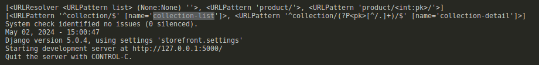

# CLASS VIEW
Class-based views are an alternative approach to handling requests in Django compared to traditional function-based views. They offer several advantages, including:

``Organization``:
  Code related to specific HTTP methods (GET, POST, etc.) is organized within separate methods of a class, improving readability and maintainability.

``Object-Oriented Structure``:
  Class-based views leverage object-oriented principles, promoting reusability through inheritance and mixins (multiple inheritance).

``Flexibility``:
  You can customize various aspects of the view's behavior by overriding methods or using mixins.

## Basic Way:
```.py
#from django.shortcuts import get_list_or_404, get_object_or_404
#from rest_framework.response import Response
#from rest_framework.request import Request
from rest_framework.views import APIView
#from .models import Product, Collection
#from .serializer import ProductSerializer, CollectionSerializer

class ProductView(APIView):
   def get(self, req:Request):
      queryset= Product.objects.select_related('collection').all()
      serializer = ProductSerializer(queryset, many=True)
      return Response(serializer.data)
    
   def post(self, req:Request):
      data_passing = ProductSerializer(data=req.data)
      data_passing.is_valid(raise_exception=True)
      data_passing.save()
      print(data_passing) # DESERILIZED
      return Response(req.data)  
```
## Without CLass View:
```.py
@api_view(["GET","POST"])
def test(req: Request):
     """DOCUMENTATION ABOUT THIS MODULE"""
     print(f'action: {req.method}')
     if req.method == 'GET':
         queryset= Product.objects.select_related('collection').all()
         serializer = ProductSerializer(queryset, many=True)
         return Response(serializer.data)
     if req.method == 'POST':
         data_passing = ProductSerializer(data=req.data)
         data_passing.is_valid(raise_exception=True)
         data_passing.save()
         print(data_passing) # DESERILIZED
         return Response(req.data)
```

# MIXING
In Django, mixins (short for mixins classes) are a powerful technique for code reuse and promoting modularity in class-based views. They are essentially classes that contain reusable methods and attributes that you can incorporate into your custom view classes. This allows you to avoid code duplication and keep your views well-organized.

Mixins
- ListModelMixin (listOfrecords)       
- CreateModelMixin (create)
- RetrieveModelMixin (retrive)
- UpdateModelMixin (update)
- DestroyModelMixin (destroy)
```
for example `APIView` allow you to:
 create--------------+-+\
 destroy-------------+-| \
 update--------------+-|  `APIView`: allow you 
 retrive-------------+-|  / makes all those action
 listOfrecords-------+-+/
 ```

 

# Concrete View Classes
concrete views classes allow you the conbination of
diferents mixing thi is are common used for that reason
GitHubNext  Previous SearchDjango REST framework

 Concrete View Classes
- CreateAPIView     
- ListAPIView
- RetrieveAPIView
- DestroyAPIView
- UpdateAPIView
- ListCreateAPIView (ListModelMixin, CreateModelMixin)
- RetrieveUpdateAPIView
- RetrieveDestroyAPIView
- RetrieveUpdateDestroyAPIView

```.py 
class ListCreateAPIView(mixins.ListModelMixin,
                        mixins.CreateModelMixin,
                        GenericAPIView):
  ...
```

This allow just to `list` the record and `create` them.

```.py
class ProductView(APIview):
   def get(self, req:Request):
      queryset= Product.objects.select_related('collection').all()
      serializer = ProductSerializer(queryset, many=True)
      return Response(serializer.data)
    
   def post(self, req:Request):
      data_passing = ProductSerializer(data=req.data)
      data_passing.is_valid(raise_exception=True)
      data_passing.save()
      print(data_passing) # DESERILIZED
      return Response(req.data)     
```
We can implement the logic of those methods using simple logic like using the 
ListCreateAPIView with just few line of code.

like this: 
```.py
from rest_framework.generics import ListCreateAPIView

# PRODUCT VIEW SECTION CLASS #
class ProductView(ListCreateAPIView):
   """Product Class View"""
   def get_queryset(self):
      return Product.objects.select_related('collection').all()

   def get_serializer_class(self, *args, **kwargs):
      return ProductSerializer
   
   def get_serializer_context(self):
      return {'request': self.request}
```

# Concrete View RetrieveUpdateDestroyAPIView Class concrete view
```.py 
class collection_id(RetrieveUpdateDestroyAPIView):
 
    def get_queryset(self):
       return Collection.objects.all().annotate(products_counts=Count('product'))
    
    def get_serializer_class(self):
       return CollectionSerializer
    

    def get_serializer_context(self):
       return {
          'request': self.request
       }
    
    def delete(self, req: Request, pk:int): 
       collection_object =  Collection.objects.all().filter(pk=pk).annotate(products_counts=Count('product'))
       collection_records_returned = len(list(collection_object))
       if collection_records_returned <= 0:
             return Response({'error':'This collection Does not exits'}, status=status.HTTP_404_NOT_FOUND)
       collection_product_count = collection_object[0].products_counts
       if collection_product_count > 0:
             return Response({'error':f'This Collection Can not be delete, There are {collection_product_count} ordered items with this collection'})
       collection_object.delete()
       return Response(status=status.HTTP_204_NO_CONTENT)
``` 
Allowing us to delete one specific element.

# Working with viewSet
In Django REST framework (DRF), viewsets are a powerful concept that simplifies the process of building API endpoints, especially for interacting with models. They offer a more concise and efficient way to handle common CRUD (Create, Read, Update, Delete) operations compared to traditional function-based or class-based views.

We can also combine the logic for those views avoiding write messy code:

```.py
# PRODUCT VIEW SECTION #
class ProductView(ListCreateAPIView):
   """Product Class View"""
   def get_queryset(self):
      return Product.objects.select_related('collection').all()

   def get_serializer_class(self, *args, **kwargs):
      return ProductSerializer
   
   def get_serializer_context(self):
      return {'request': self.request}
 
   

# PRODUCT VIEW SECTION #
class ProductView_id(RetrieveUpdateDestroyAPIView):

    def get_queryset(self):
       return Product.objects.all()
    
    def get_serializer_class(self):
       return ProductSerializer
    
    def get_serializer_context(self):
       return {
          'request': self.request
       }
    
   # def delete(self, req: Request, pk:int):
   #    product_object = get_object_or_404(Product, pk=pk)
   #    orderItem_product_count = product_object.orderitems.count()
   #    print(orderItem_product_count)
   #    if orderItem_product_count > 0:
   #          return Response({'error':f'This Product Can not be delete, There are {orderItem_product_count} items ordered'})
   #    product_object.delete() # it will call the delete method and will delete the product.
   #    return Response(status=status.HTTP_204_NO_CONTENT)
```
The `ModelViewSet` class from the `viewset(module)`  inherits from GenericAPIView and includes implementations for various actions, by mixing in the behavior of the various mixin classes.


Skiping the delete method the logic used for both views(Class) in the previus code are baically the 
same. (ProductView_id, ProductView) so using ModelViewSet we can use one single class for both of those logic.

The actions provided by the ModelViewSet class are .list(), .retrieve(), .create(), .update(), .partial_update(),
and .destroy().

```.py 


# COLLECTION VIEW SECTION #
class CollectionModelView(ModelViewSet):
    """DOCUMENTATION ABOUT THIS MODULE"""
    def get_queryset(self):
       return Collection.objects.all().annotate(products_counts=Count('product')) 
   
    def get_serializer_class(self):
       return CollectionSerializer
    
    def get_serializer_context(self):
       return {'request': self.request}
    
    def delete(self, req: Request, pk:int): 
       collection_object =  Collection.objects.all().filter(pk=pk).annotate(products_counts=Count('product'))
       collection_records_returned = len(list(collection_object))
       if collection_records_returned <= 0:
             return Response({'error':'This collection Does not exits'}, status=status.HTTP_404_NOT_FOUND)
       collection_product_count = collection_object[0].products_counts
       if collection_product_count > 0:
             return Response({'error':f'This Collection Can not be delete, There are {collection_product_count} ordered items with this collection'})
       collection_object.delete()
       return Response(status=status.HTTP_204_NO_CONTENT)
```
# Router 

Resource routing allows you to quickly declare all of the common routes for a given resourceful controller. 
Instead of declaring separate routes for your index... a resourceful route declares them in a single line 
of code.

Some Web frameworks such as Rails provide functionality for automatically determining how the URLs for an application should be mapped to the logic that deals with handling incoming requests.

REST framework adds support for automatic URL routing to Django, and provides you with a simple, quick and consistent way of wiring your view logic to a set of URLs.


There are two mandatory arguments to the register() method:

prefix - The URL prefix to use for this set of routes.: collection
viewset - The viewset class.: views.CollectionModelView

Optionally, you may also specify an additional argument:
  basename - The base to use for the URL names that are created. If unset the basename will be automatically generated based on the queryset attribute of the viewset, if it has one. Note that if the viewset does not include a queryset attribute then you must set basename when registering the viewset.


  

```.py
from django.urls import path, include
from rest_framework.routers import SimpleRouter
from . import views

router = SimpleRouter()
router.register(
    'collection',
    views.CollectionModelView
)
```

# Nested Router
In Django REST framework (DRF), nested routers are a third-party library extension that
helps you manage API endpoints for resources with hierarchical relationships. 

Understanding Nested Data:

Imagine a scenario where you have models representing Author and Book. An Author can have many Books associated with them. This creates a nested relationship between these models.
 ```
  http://127.0.0.1:8000/store/author/2/books
                                     \
                                      [author's id]
```

For using Nested Routers: 
`
pip install drf-nested-routers

`

While (DRF) provides basic router functionalities, nested routers offer a 
more streamlined approach for handling nested data structures within your 
API.

```.py
from rest_framework_nested import routers
from django.urls import path, include
from rest_framework.routers import SimpleRouter
from . import views

router = SimpleRouter()
router.register(
    'product',
    views.ProductModelView
)

domains_router = routers.NestedSimpleRouter(router, r'product', lookup='product') # 
domains_router.register(r'reviews', views.ReviewModelVIew, basename='product-reviews')
```
```
 when we talk about hierarchical relationship:
 http://127.0.0.1:8000/store/product/2/reviews
                                +----+---------------['domain']
                                     +---------------[lookup]
```
In this case, for better understanding, we're making the relation 
ID with a simple integer example, but normally those are defined in
a large string representation.


# Filtering in Django 

In Django, filtering allows you to narrow down your database query results
based on specific criteria. This is essential for retrieving only the data 
that meets your requirements in your views or other parts of your application. 

let's say that you want to filter all product by a x collection, le't say
filter all the product in the (Baby) collection.

   `URL BODY: http://127.0.0.1:8000/store/product/?collection_id=3`


This's When we need to overwrite the get_queryset method from 
ModelViewSet using a logic depending of the queryset that is 
need.

```.py 
# PRODUCT VIEW SECTION #
class ProductModelView(ModelViewSet):
   """Product Class View"""

   def get_queryset(self):
      req= self.request
      queryset =  Product.objects.select_related('collection').all()

      # URL BODY: http://127.0.0.1:8000/store/product/?collection_id=3
      collection_id = req.query_params.get('collection_id')
      if collection_id != None:
          return queryset.filter(collection_id=collection_id)  
      return queryset
        

   def get_serializer_class(self, *args, **kwargs):
      return ProductSerializer
   
   def get_serializer_context(self):
      return {'request': self.request}
 

   def destroy(self, request, *args, **kwargs):
       product_object = get_object_or_404(Product, pk=kwargs['pk'])
       orderItem_product_count = product_object.orderitems.count()
       print(orderItem_product_count)
       if orderItem_product_count > 0:
             return Response({'error':f'This Product Can not be delete, There are {orderItem_product_count} items ordered'})
       return super().destroy(request, *args, **kwargs)   
```

# django-filter

Django-filter is a reusable Django application that simplifies the process of adding
dynamic filtering functionalities to your Django views based on user selections. It 
offers a declarative approach for creating filtersets that seamlessly integrate with 
Django's querysets and model forms.

## Instalation
```pip install django-filter
```
INSTALATION STEPS:
https://django-filter.readthedocs.io/en/stable/guide/install.html


E.i:
   The Example above can be implemented in the same way:
```.py

# PRODUCT VIEW SECTION #
class ProductModelView(ModelViewSet):
   """Product Class View"""
   
   queryset = Product.objects.select_related('collection').all()
   filter_backends = [DjangoFilterBackend]
   filterset_fields = ['collection_id']
   

   def get_serializer_class(self, *args, **kwargs):
      return ProductSerializer
   
   def get_serializer_context(self):
      return {'request': self.request}
 

   def destroy(self, request, *args, **kwargs):
       product_object = get_object_or_404(Product, pk=kwargs['pk'])
       orderItem_product_count = product_object.orderitems.count()
       print(orderItem_product_count)
       if orderItem_product_count > 0:
             return Response({'error':f'This Product Can not be delete, There are {orderItem_product_count} items ordered'})
       return super().destroy(request, *args, **kwargs)
```
   


## Key Features of django-filter:

- ``Declarative Filter Creation``: Define filters based on your model fields, reducing the need for manual queryset manipulation.

- ``Integration with Model Forms``: Filtersets can be used in conjunction with Django model forms, allowing users to filter data and
    submit forms simultaneously.

- ``Automatic URL Configuration (Optional)``: When used with Django REST framework (DRF), django-filter can automatically generate filter 
    URLs for your API endpoints.

- ``Flexibility``: You can customize filter behavior by overriding methods or using custom filter widgets.

In essence, django-filter is a valuable tool for building dynamic and user-friendly filtering functionalities 
in Django applications. It streamlines filter creation, improves maintainability, and empowers you to create 
a more interactive user experience.

# USING CLASS DJANGO-FILTER
The FilterSet is capable of automatically generating filters for a given model’s fields. Similar to Django’s ModelForm, 
filters are created based on the underlying model field’s type. This option must be combined with either the fields or
exclude option, which is the same requirement for Django’s ModelForm class.

Whether using django-filter with class-based views is better depends on the complexity of your filtering requirements and 
your overall project structure. Here's a breakdown of the pros and cons to help you decide:

## Advantages of Using django-filter with Class-Based Views:

- Separation of Concerns: Filter logic is encapsulated within the filterset class, promoting cleaner and more maintainable views.

- Reusability: The filterset class can be reused across different views that require filtering on the same model.

- Improved Readability: Class-based views with django-filter often have a clearer structure, making the filtering logic easier to understand.
Automatic URL Configuration (with DRF): When used with Django REST framework (DRF), django-filter simplifies API endpoint URL generation for filtering.


```.py
from django_filters.rest_framework import DjangoFilterBackend
from django_filters import rest_framework as filters
import django_filters


class ProductFilter(filters.FilterSet):

    unit_price = django_filters.LookupChoiceFilter(
            field_class=forms.DecimalField,
            lookup_choices=[
                ('exact', 'Equals'),
                ('gt', 'Greater than'),
                ('lt', 'Less than'),
            ]
        )
 
    min_date = filters.DateRangeFilter(field_name="last_update")
 
 
    class Meta:
        model = Product
        fields = ['collection']
```

This class must to be added in the view class as the follow:
 
 ```.py 
 class ProductModelView(ModelViewSet):
   """Product Class View"""
   filter_backends = [DjangoFilterBackend]
   filterset_class = ProductFilter

   def get_queryset(self):
      req= self.request
      queryset =  Product.objects.select_related('collection').all()

      # URL BODY: http://127.0.0.1:8000/store/product/?collection_id=3
      collection_id = req.query_params.get('collection_id')
      if collection_id != None:
          return queryset.filter(collection_id=collection_id)  
      return queryset
        

   def get_serializer_class(self, *args, **kwargs):
      return ProductSerializer
   
   def get_serializer_context(self):
      return {'request': self.request}
 

   def destroy(self, request, *args, **kwargs):
       product_object = get_object_or_404(Product, pk=kwargs['pk'])
       orderItem_product_count = product_object.orderitems.count()
       print(orderItem_product_count)
       if orderItem_product_count > 0:
             return Response({'error':f'This Product Can not be delete, There are {orderItem_product_count} items ordered'})
       return super().destroy(request, *args, **kwargs)
   
```

It will show you a better interface with a filter more specified: 
   


# Searching
The SearchFilter class supports simple single query parameter based searching, and 
is based on the Django admin's search functionality. this other filter backend funtio
nality added by rest framework follow the same step if filter django used before.


```.py 
from rest_framework.filters import SearchFilter


class ProductModelView(ModelViewSet):
   """Product Class View"""
   filter_backends = [DjangoFilterBackend, SearchFilter]
   filterset_class = ProductFilter
   search_fields = ['title']

   def get_queryset(self):
      req= self.request
      queryset =  Product.objects.select_related('collection').all()

      # URL BODY: http://127.0.0.1:8000/store/product/?collection_id=3
      collection_id = req.query_params.get('collection_id')
      if collection_id != None:
          return queryset.filter(collection_id=collection_id)  
      return queryset
        

   def get_serializer_class(self, *args, **kwargs):
      return ProductSerializer
   
   def get_serializer_context(self):
      return {'request': self.request}
 

   def destroy(self, request, *args, **kwargs):
       product_object = get_object_or_404(Product, pk=kwargs['pk'])
       orderItem_product_count = product_object.orderitems.count()
       print(orderItem_product_count)
       if orderItem_product_count > 0:
             return Response({'error':f'This Product Can not be delete, There are {orderItem_product_count} items ordered'})
       return super().destroy(request, *args, **kwargs)
   
```

# Sorting
in Django REST framework (DRF), sorting allows you to control the order in which API responses are returned. This is crucial for enabling users to organize
data based on their preferences, such as sorting articles by date or products by price.

1. Using ordering Query Parameter:

DRF provides a built-in way to specify sorting criteria through the ordering query parameter in API requests.
Clients (like web applications) can include this parameter with field names to indicate the desired sorting order.

```
GET /articles/?ordering=published_date  # Sort by published date (ascending)
GET /articles/?ordering=-published_date  # Sort by published date (descending)
GET /articles/?ordering=title,author  # Sort by title (ascending) then author (ascending)
```

```.py 
from rest_framework.filters import OrderingFilter

class ProductModelView(ModelViewSet):
   """Product Class View"""
   filter_backends = [DjangoFilterBackend, SearchFilter, OrderingFilter]
   filterset_class = ProductFilter
   search_fields = ['title']
   ordering_fields = [
       'title'
   ]

   def get_queryset(self):
      req= self.request
      queryset =  Product.objects.select_related('collection').all()

      # URL BODY: http://127.0.0.1:8000/store/product/?collection_id=3
      collection_id = req.query_params.get('collection_id')
      if collection_id != None:
          return queryset.filter(collection_id=collection_id)  
      return queryset
        

   def get_serializer_class(self, *args, **kwargs):
      return ProductSerializer
   
   def get_serializer_context(self):
      return {'request': self.request}
 

   def destroy(self, request, *args, **kwargs):
       product_object = get_object_or_404(Product, pk=kwargs['pk'])
       orderItem_product_count = product_object.orderitems.count()
       print(orderItem_product_count)
       if orderItem_product_count > 0:
             return Response({'error':f'This Product Can not be delete, There are {orderItem_product_count} items ordered'})
       return super().destroy(request, *args, **kwargs)
   
```
In this Case it will ordering it By title.