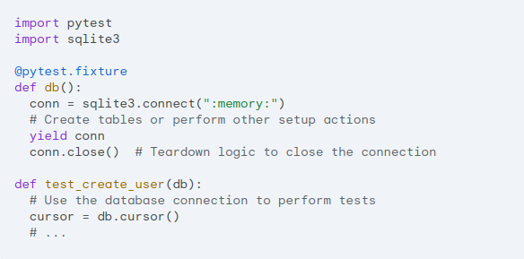
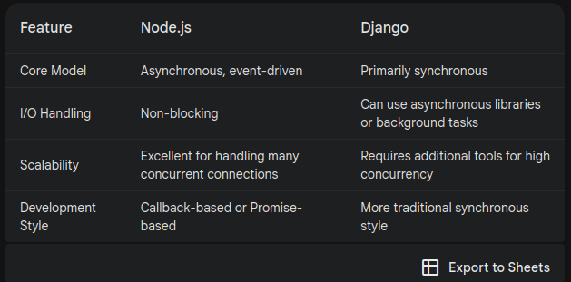

# What is Automation Testing #s

Automation testing is the practice of automating the execution of test cases through scripts
and/or specialized tools. Instead of having a human tester manually executing test case by
test case, these scripts and tools directly command the Application Under Test (AUT) to perform
all of the required actions. It frees up bandwidth for testers to focus more on more strategic
activities.

Automated testing is an extremely useful bug-killing tool for the modern web developer. You can
use a collection of tests – a test suite – to solve, or avoid, a number of problems:

 - When you’re writing new code, you can use tests to validate your code works as expected.

 - When you’re refactoring or modifying old code, you can use tests to ensure your changes
   haven’t affected your application’s behavior unexpectedly.

# TEST FRAMEWORKS #

Django actually comes with its own built-in testing framework that leverages the standard Python unittest module. This framework provides a foundation for writing various types of tests, including unit and integration tests.
 1. unittest
 2. pytest > THe documentation


For this documentation you may have to install the next packages for development:
  ```pip install --dev pytest```
  ``` pip install --dev pytest-django ``` 
   those are packages dependencies for using django test

# STEPS NOTES #:
1. Create a directory in your current app called tests; it must be important that the name is
   in  plural because Django will look at this [tests] directory. You can be configurable this
   in the django documentation you will found more information.

2. All the files inside that directory must be called. [test_typeoftest], all of them must start
   with the test_; this is  easier to understand in it will bring you more information about the testing process; again, you can change this configuration; look at the Django documentation.

3. Inside of that test file, all the functions or methods must start with a test_.
   
   ```py
      def test_if_user_has_not_credentials_returns_401(self):
          ...
   ```
   
   The classes in the same case must start with a test. In the case of the clases, the first letter must be in uppercase, just like this. TestCreateUser.
    
    ```py
      class TestCreateCollection:
        def test_if_user_has_not_credentials_returns_401(self):
          ... 
    ```
4. Telling pytest where our setting model is; for that, we need to create a test configuration file in the root folder. It allows you to customize various aspects of how pytest runs your tests.
   create the pytest configuration file:
    ``pytest.ini``
   ```py
      [pytest]
      DJANGO_SETTINGS_MODULE=storefront.settings
   ```

   [pytest]: This section header indicates that the following configuration options are specific to pytest.

   DJANGO_SETTINGS_MODULE=storefront.settings: This line configures the pytest-django plugin. It tells pytest
   which Django settings module to use when running your tests. In this case, it specifies the settings module 
   within the storefront package.


# Test Structure # 

    All test should have three parts
       AAA: Triple As
       A: Arrange (We call for data to be tested)
       A: Act (Sending requests to the sever see how it perform them)
       A: Assert (The behavior and how it must be)

       Imagine testing a function that calculates the area of a rectangle.
            Arrange: Create two variables, length and width, and assign them values.
            Act: Call the calculateArea function with length and width as arguments.
            Assert: Verify that the returned area is correct.

   ```py
      from rest_framework.test import APIClient
      from rest_framework import status
      class TestCreateCollection:
        def test_if_user_has_not_credentials_returns_401(self):
           # A: Arrange (We call for data to be tested)
              # empety in this case

           # A: Act (Sending requests to the sever see how it perform them)
            response = APIClient().post('/store/collection/', {'title':'a'})
           
           # A: Assert (The behavior and how it must be)
            assert response.status_code == status.HTTP_401_NOT_FOUND 
   ```

# How it Works? #
1. In pytest, fixtures are special functions that help you manage the setup and teardown of resources for your tests. They essentially create a controlled environment for each test to run in, ensuring consistency and reusability of your test code.

2. Setup and Teardown:  Fixtures can perform actions before a test runs (setup) and after it finishes (teardown). This is useful for initializing databases, opening files, or creating objects needed by your tests.

3. Data Provision:  Fixtures can provide test data to your tests. This can be anything from simple values to complex objects.  Reusing fixtures with different data sets allows you to write more comprehensive tests.

4. Improved Readability and Maintainability: By separating setup, teardown, and data provisioning concerns from your test logic, fixtures make your tests easier to read and understand. They also help avoid code duplication and improve the overall maintainability of your test suite.

   In this example, the username fixture simply returns a string value. The 
   test function then receives this value as an argument and can use it for
   assertions.

      ```py
            import pytest

            @pytest.fixture
            def username():
            return "admin"

            def test_login(username):
            # Your test logic using the username fixture
            assert username == "admin"
      ```


5. Here, the db fixture establishes a connection to a temporary in-memory SQLite database. 
   The test uses the yield statement to provide the connection to the test function. After
   the test finishes, the connection is closed automatically.
   
   

# Commands #
 ```pytest```: Execute all the test in this porject.

 ```pytest store/tests/```: Execute all the test in this directory.
 
 ```pytest store/tests/test_collection.py```: Execute a particular test file.
 
 ```pytest store/tests/test_collection.py::TestCreateCollection```:Execute a particular Class in the test_collection file.

 ```pytest store/tests/test_collection.py::TestCreateCollection::test_if_user_has_not_credentials_returns_401```:Execute a particular method in the class TestCreateCollection in the file test_collection.

# AUTOMATED TESTING DJANGO #
Automated testing is an extremely useful bug-killing tool for the modern web developer. You can use a collection of tests – a test suite – to solve, or avoid, a number of problems:

 1. When you’re writing new code, you can use tests to validate your code works as expected.

 2. When you’re refactoring or modifying old code, you can use tests to ensure your changes haven’t affected your application’s behavior unexpectedly.


# Working with continuous testing #
  Continuous Testing is a software development practice 
  that involves testing applications continuously throughout 
  the entire software development lifecycle (SDLC). It's an
  integral part of DevOps and Agile methodologies, aiming to
  deliver high-quality software faster.

  Key Principles of Continuous Testing:
    ``Early and Frequent Testing``: Tests are executed as soon as code changes are committed, providing rapid feedback.
    ``Automation``: Test automation is essential to achieve continuous testing efficiency.
    ``Risk-Based Testing``: Prioritize tests based on potential impact and risk.
    ``Shift-Left Testing``: Involve testing early in the development cycle to catch defects sooner.
    ``Test Environment Management``: Ensure reliable and consistent test environments.

    There are two ways to run code in Django. We can run demand by using
    command test like before or we can run the test all the time.
    
 1. Installing pi test Plugins
 2. ``` pip install --dev pytest-watch ```
 3. ```ptw```: Start the pytest-Watch every time you make change in the code
               it will invoke the pytest

# Good Practicate Test Notes #
  REST framework includes a few helper classes that extend Django's
  existing test framework, and improve support for making API requests.
   
  You can read a lot more in the documentation:
    https://www.django-rest-framework.org/api-guide/testing/#apiclient

  ``force_authenticate``: is a method within Django REST Framework's APIClient
  class that allows you to manually simulate authentication for your test
  requests. It's particularly useful when you need to test protected API
  endpoints without going through the full authentication flow. 

# Single or Multiples Assertion #
 Is this good practice?
  The short answer is: It depends.

  While there's a strong argument for single assertion tests,
  aiming for clarity and isolation, the reality is often more nuanced.

 - ## The Case for Single Assertions ##
  
    ``Clarity``: Each test focuses on a single aspect of the code, making it easier to understand and debug.
    
    ``Isolation``: Failures pinpoint the exact issue, without ambiguity.

    ``Maintainability``: Tests are generally easier to modify or extend.

- ## The Case for Multiple Assertions ##
  
   ``Efficiency``: Reduces test setup and teardown overhead for related assertions.

   ``Logical Grouping``: When multiple assertions are closely related, combining them can improve readability.

- ##  Best Practices - ## 

    Prioritize clarity and isolation.
    Use multiple assertions judiciously.
    Consider test readability and maintainability.
    Leverage test frameworks features: Some frameworks offer ways to group assertions or provide detailed failure information.

 
 # [# Using Fixture # ](https://docs.pytest.org/en/stable/how-to/fixtures.html) #

  Previously we talked about fixtures; let's make another simple example of using this beautiful decorator.

  1. Create a ``conftest.py`` in the ``tests`` directory
 
  2. Add the Follwing Code:
     ```py
         import pytest
         from rest_framework.test import APIClient

         @pytest.fixture
         def action_clinet():
            print("Actionn Fixture")
            return APIClient()
     ```
     You can pass that function as parameters in your test method.
     it'll retrun the APIClient Objects.
  
  3. Take a look in this example:
      ```py
         @pytest.mark.django_db
         class TestCreateCollection:
            def test_if_user_has_not_credentials_returns_401(self, action_clinet):
                  # A: Arrange (We call for data to be tested)
                        # empety in this case

                  # A: Act (Sending requests to the sever see how it perform them)
                  response = action_clinet.post('/store/collection/', {'title':'a'})
                  print("Running Test...")
                  
                  # A: Assert (The behavior and how it must be)
                  assert response.status_code == status.HTTP_401_UNAUTHORIZED
      ```
   4. What is ``conftest.py`` for in Pytest?
   
   In Pytest, ``conftest.py`` is a special file used for several purposes, but its primary
   function is to provide fixtures for your tests.

   ``Before any tests are run``: The conftest.py file is processed to identify and register fixtures and other customizations.
   
   ``For each test module``: If conftest.py is found in the same directory as a test module or in any parent directory, it's
   loaded and its contents are processed.

# Writting test for retriving a collection # 
  Previus Example: 
  Arrange: Create two variables, length and width, and assign them values.
  This is when we need to insert temporal data to see if we can retrieve it.

   ```py
      @pytest.mark.django_db
      class TestRetriveCollection:

         def test_if_the_collection_is_retrived_retrun_200(self, action_clinet):
               collection_create =  Collection.objects.create(title='Hello')
               action_clinet.force_authenticate(user=User(is_staff=True, is_superuser=True))
               response = action_clinet.get(f'/store/collection/{collection_create.id}/')
               assert response.status_code == status.HTTP_200_OK 
   ```
   ## model-bakery ##
   
   Allow you to perform the same thing as above, reducing 
   the amount of code and generating data automatically.

   ### Instalation ###
   ```pip install model_bakery```

   It offers you a smart way to create fixture
   for testing in django. With a simple and 
   powerfull api you can create many object
   with a single line of code.

   ```py
      @pytest.mark.django_db
      class TestRetriveCollection:
         def test_if_the_collection_is_retrived_retrun_200(self, action_clinet):
            collection = baker.make(Collection) # Create the collection #
            action_clinet.force_authenticate(user=User(is_staff=True is_superuser=True))
            response = action_clinet.get(f'/store/collection/{collection.id}/')
            assert response.status_code == status.HTTP_200_OK 
   ```

# Performance Testing #
   Performance testing is absolutely critical for delivering high-quality software. It's often 
   overlooked or given lower priority, but it's essential for ensuring a positive user experience,
   system stability, and overall application success.

   Locust is an excellent choice for performance testing. It's a Python-based, open-source tool
   designed to handle massive amounts of simulated users.

   ## Key Advantages of Locust: ##
   
   ```Python-based```: Leveraging your Python skills for test creation.   

   ```Scalability```: Can simulate millions of users to test system performance under heavy load.  

   ```Real-time monitoring```: Provides insights into performance metrics during the test.  

   ```Flexibility```: Supports various protocols and can be customized for specific needs.  

   ```Community and ecosystem```: A strong community and extensive documentation.  
   
   ## Instalation ##
   Documentation: https://docs.locust.io/en/stable/what-is-locust.html   
   dev-depencie: ```pip install --dev locust``` 
   depencie: ```pip installl locuts```

   # CORE USER CASES #

   For a start-written test script, we need to know the core use
   cases. This is done by asking what  are those actions that the user can perform:

   1. Things like browsing products or like sing in or sing out are actions that our users have to do often
      (this is in the case of this API store).

   This is divied in three parts:
     ```py
         class WebsiteUser(HttpUser):
            pass
            # viewing all the product #

            # viewing a product details #

            # Add a product to the card #
     ```
   source code:
   ```py
      from random import randint
      from locust import HttpUser, task, between


      class WebsiteUser(HttpUser):

      wait_time = between(1, 5) # 1 seconds to 5 seconds random #  

      @task(1)
      def view_products(self):
            collection_id = randint(1,4) 
            self.client.get(f'/store/product?collection_id={collection_id}', name='/store/product')
            
      @task(4)
      def view_product(self):
            product_id = randint(1,20)
            self.client.get(f'/store/product/{product_id}', name='/store/product/:id')
      
      @task(3)
      def add_product_cart(self):
            product_id = randint(1,20)
            product_cart = self.cart_id
            self.client.post(f'/store/cart/{product_cart}/cartitems/', name='cartitems', json={ "product":product_id, "quantity": 12})
            
      def on_start(self):
            response = self.client.post(f'/store/cart/', name='new user')
            json_result = response.json() # Pass form json to normal object #
            self.cart_id = json_result['id']
   ```


   `@task`: With the decorator task, it will make the method a task.

   `self.client`: self.client is an instance of the HttpUser class's
   underlying HTTP client, typically requests. It provides a convenient
   way to make HTTP requests within your Locust user class. 
   
   To start the performance test we use the next command:  
      ```  locust -f locust_performance/browse_product.py ``` 
   
   # Performance Optimization Techniques #
   When used correctly, the Django ORM allows you to relieve the database from high load,
   minimize database queries, and make your web app much faster. Database optimization is 
   especially crucial for highly dynamic apps that can't utilize caching as much.

   The key to database optimization is understanding
   how Django's QuerySet works. 
   
   It has two important properties you should remember:


   `QuerySets are lazy`:The act of creating them or adding
   filters to them doesn't involve any database activity. 
   They're only evaluated when you perform specific actions
   on them such as iteration, checking their length, testing
   them in a boolean context, and so on.

   `Django caches QuerySets`: to minimize database access. Make sure
   to check out the documentation to understand when queries are and
   are not cached.


   ## Here are some tips you can use for efficient QuerySet use ##:

    1. Retrieve everything you need at once, and only what you need.

    1. Limit your QuerySet to the number of results you need.

    2. Do not order your QuerySet if you don't care about the order.

    3. Creating, updating, and deleting in bulk is more efficient than doing it separately.

    4. Querying in loops is usually bad practice. Rethink your query.

    5. Raw SQL should be avoided whenever possible unless you have a valid reason not to.

    6. Use an iterator() if you don't want your query results to be cached in memory.

    Python Code: 
    ```py
     # preload relared object @
     App.objects.select_related(...)
     App.objects.prefect_related(...)

     # Load only what you need #
     App.objects.only('name')
     App.objects.defer('lastname')


     # Use Values #
     App.objects.values() # only include those field in the dictionary #
     App.objects.values_lits() #  but returns a QuerySet of tuples instead of dictionaries. 


     App.objects.count() # 400 objects
     len(App.objecrs.all()))  #  400 objects Bad Performance 

     # Bulk crerate/update 
     App.objects.bulk([]) # [{},{}] create all of them in just one query

    ```

    #  DJANGO VS NodeJs #
    
    