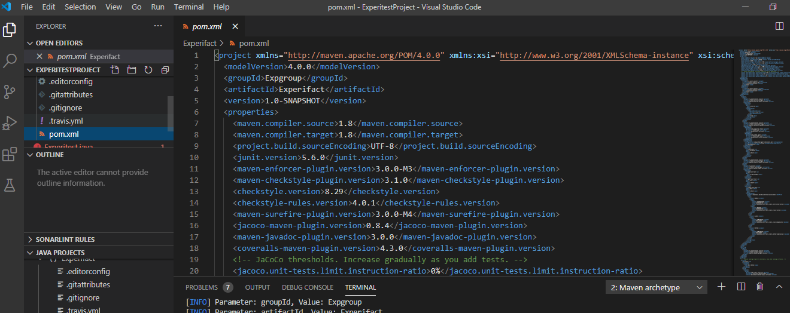

# What is Automation Testing #s

Automation testing is the practice of automating the execution of test cases through scripts
and/or specialized tools. Instead of having a human tester manually executing test case by
test case, these scripts and tools directly command the Application Under Test (AUT) to perform
all of the required actions. It frees up bandwidth for testers to focus more on more strategic
activities.

Automated testing is an extremely useful bug-killing tool for the modern web developer. You can
use a collection of tests – a test suite – to solve, or avoid, a number of problems:

 - When you’re writing new code, you can use tests to validate your code works as expected.

 - When you’re refactoring or modifying old code, you can use tests to ensure your changes
   haven’t affected your application’s behavior unexpectedly.

