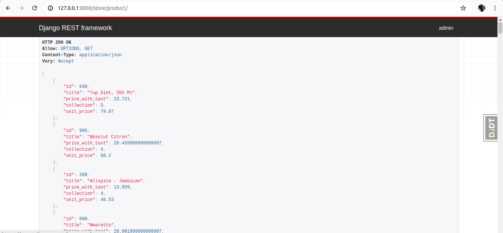
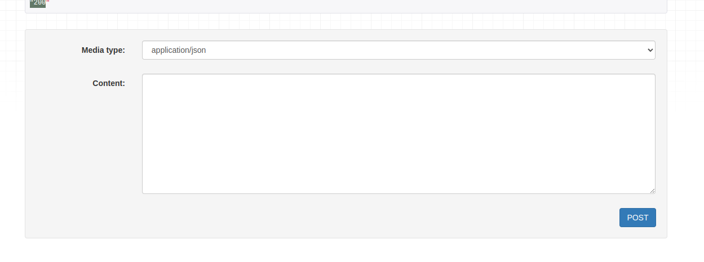
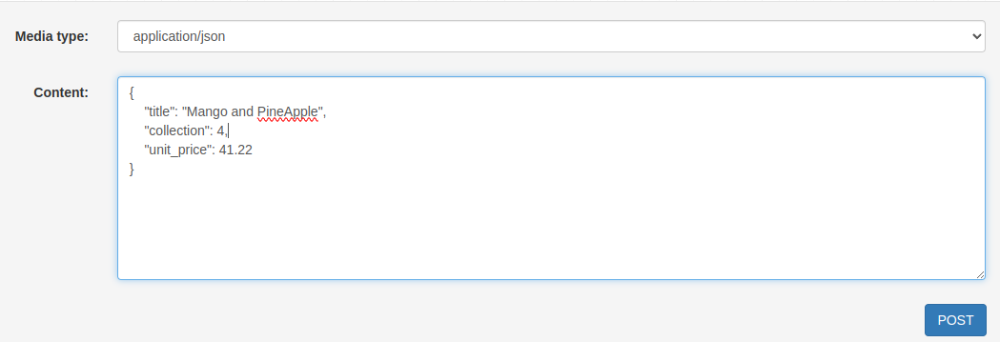

# Using Rest Frame Work
```> pip install djangorestframework```

Django REST framework (DRF) is a powerful and versatile toolkit designed specifically for building Web APIs using the Django web framework. It provides a streamlined approach to creating APIs that adhere to the REST (Representational State Transfer) architectural style.

(INSTALLED APP)
```.py
INSTALLED_APPS = [
    ...
    'rest_framework',
    ...
]
```

(urls.py)
```.py
path('api-auth/', include('rest_framework.urls'))
```

# ADDING ID TO THE END POINT *(IN  YOUR APP)
Capturing the ID in the URL Path:

URL Patterns: When defining your URL patterns, incorporate a capture group using <int:pk> or <int:id> (depending on your ID field type) within the endpoint path. This placeholder will capture the ID value from the incoming request URL.

```urls.py```
```.py 
from django.urls import path
from . import views

# URLConf
urlpatterns = [
    path('product/', views.test),
    path('product/<int:id>/', views.product_id)
]
```

```views.py```
```.py
@api_view()
def product_id(req, id):
    return Response(id)
```

# SERIALIZER

In Django, serializers specifically refer to those within
the Django REST framework (DRF), a powerful toolkit for 
building Web APIs using Django. These serializers act as
intermediaries between your Django models and the API
representation of your data.

Data Serialization: Serializers transform complex data structures like Django model instances into simpler Python data types (dictionaries, lists) that can be easily rendered into JSON, XML, or other content formats suitable for API responses.

```serializer.py```
```.py
class ProductSerializer(serializers.Serializer):
    id = serializers.IntegerField()
    title = serializers.CharField(max_length=255)
    unit_price = serializers.DecimalField(        
        max_digits=6,
        decimal_places=2,
        )
```

```view.py```
```.py
from django.shortcuts import get_list_or_404, get_object_or_404
from rest_framework.decorators import api_view
from rest_framework.response import Response
from rest_framework import status
from .models import Product
from .serializer import ProductSerializer

@api_view()
def test(req):
    """DOCUMENTATION ABOUT THIS MODULE"""
    queryset= Product.objects.all()
    # Passing the ProductSerializer Serializer
    serializer = ProductSerializer(queryset, many=True)
    return Response(serializer.data)

@api_view()
def product_id(req, id):
    product_data = get_object_or_404(Product, pk=id)
    # Passing the ProductSerializer Serializer
    serializer_dat = ProductSerializer(product_data)
    return Response(serializer_dat.data)
```

# SERIALIZER RELATIONSHIP
In Django REST framework (DRF), serializer relationships are a crucial concept for handling related data within your API. They enable you to represent and manage the connections between different models in your API responses and requests.
```
  [MODEL(A)]        +---[MODEL(B)]
    name            |     id
    age             |     model
    modelb----------+
```

```serializer.py```

```.py
from decimal import Decimal
from rest_framework import serializers
from .models import Product, Collection 


class ProductSerializer(serializers.Serializer):
    id = serializers.IntegerField()
    title = serializers.CharField(max_length=255)
    price_with_taxt = serializers.SerializerMethodField(method_name='tax_calculation')
    # RELATED FIELD
    collection = serializers.PrimaryKeyRelatedField(
        queryset= Collection.objects.all()
    )
    # RELATED FIELD
    unit_price = serializers.DecimalField(        
        max_digits=6,
        decimal_places=2,
        )

    def tax_calculation(self, product:Product):
        return product.unit_price * Decimal(0.3)
```



# MODELSERIALIZER
THis's almost the same as Serializer
```ModelSerializer.py```
```.py
class ProductSerializer(serializers.ModelSerializer):
    model = Product
    field = ['id','title', 'unit_price', 'price_with_taxt']

    def tax_calculation(self, product:Product):
        return product.unit_price * Decimal(0.3)
```

# DESERIALIZING OBJECT

In Django, deserialization specifically refers to the process of converting data received from external sources (typically API requests or serialized data streams) back into complex data structures like Django model instances. Here's a breakdown of deserialization in Django, focusing on common approaches:

```
                 [ACTIONS]
SERIALIZED DATA  receiving -->   DESERIALIZED DATA
    client ----<Server>--------<database>
SERIALIZED DATA  back <--   DESERIALIZED DATA
                 [ACTIONS]
```

The client has to receive the data in serialized form to use it in the right way without compromising the security of the client or our system with data that we do not want to make public.


Our services as a server and database require that when receiving data from the user, the data must be deserilized, so it is possible to store it in the right way.

e.i., making the relationship somehow with another table based on the input inserted by the user or client

```views.py```
```.py 
@api_view(["GET","POST"])
def test(req: Request):
    """DOCUMENTATION ABOUT THIS MODULE"""
    if req.method == 'GET':
        queryset= Product.objects.select_related('collection').all()
        serializer = ProductSerializer(queryset, many=True)
        return Response(serializer.data)
    if req.method == 'POST':
        data_passing = ProductSerializer(data=req.data)
        return Response('200')
```

```@api_view(["GET","POST"])``` those are the method allowed in this
view for the clien by default the method 'GET' is always allowed in 
this case i just added 'POST'. At the time that we added 'POST' it
we allow us to send the data in form form.




```.py
if req.method == 'POST':
    data_passing = ProductSerializer(data=req.data)
    return Response('200')
```
When we call that action POST it will trigger this part of the code above
when ```ProductSerializer(data=req.data)``` `data` attribute is not 
equal to ``null`` this tell to the serialirzer that we are receiving data 
so it will called  anothers methods to make sure that all the cell required for 
that POST will be completed correctly.

E.i;
DJANGO CODE:
```.py
    def __init__(self, instance=None, data=empty, **kwargs):
        self.instance = instance
        if data is not empty:
            self.initial_data = data
        self.partial = kwargs.pop('partial', False)
        self._context = kwargs.pop('context', {})
        kwargs.pop('many', None)
        super().__init__(**kwargs)
```
One of those Methods will be the data validation.

# DATA VALIDATION:
Data validation is a crucial aspect of building robust Django applications. It ensures that the data you store in your database is accurate, consistent, and adheres to defined rules. Django offers several mechanisms for data validation.

For that we need to calls the is_valid() method in Django Serializer:
If something goings wrong with some filed it will raise an error.

```.py 
@api_view(["GET","POST"])
def test(req: Request):
    """DOCUMENTATION ABOUT THIS MODULE"""
    if req.method == 'GET':
        queryset= Product.objects.select_related('collection').all()
        serializer = ProductSerializer(queryset, many=True)
        return Response(serializer.data)
    if req.method == 'POST':
        data_passing = ProductSerializer(data=req.data)
        data_passing.is_valid(raise_exception=True) # :
        return Response(data_passing.data)
```
## Another Way:
```.py 
@api_view(["GET","POST"])
def test(req: Request):
    """DOCUMENTATION ABOUT THIS MODULE"""
    if req.method == 'GET':
        queryset= Product.objects.select_related('collection').all()
        serializer = ProductSerializer(queryset, many=True)
        return Response(serializer.data)
    if req.method == 'POST':
        data_passing = ProductSerializer(data=req.data)
        if (data_passing.is_valid()): 
           return Response(data_passing.data)
        else:
           return Response(data_passing.error_messages, status=status.HTTP_400_BAD_REQUEST)

```

# SHOWING THE DESERILIZED DATA
```.py
@api_view(["GET","POST"])
def test(req: Request):
    """DOCUMENTATION ABOUT THIS MODULE"""
    print(f'action: {req.method}')
    if req.method == 'GET':
        queryset= Product.objects.select_related('collection').all()
        serializer = ProductSerializer(queryset, many=True)
        return Response(serializer.data)
    if req.method == 'POST':
        data_passing = ProductSerializer(data=req.data)
        data_passing.is_valid(raise_exception=True)
        print(data_passing) # DESERILIZED
        return Response(req.data)
```


```
ProductSerializer(data={'title': 'Mango and PineApple', 'collection': 4, 'unit_price': 41.22}):
title= CharField(max_length=255)
collection= PrimaryKeyRelatedField(queryset=<QuerySet [<Collection: Baking>, <Collection: Beauty>, 
              <Collection: Cleaning>, <Collection: collection1>, <Collection: Grocery>, <Collection: Magazines>, <Collection: Pets>, <Collection: Spices>, <Collection: Stationary>, <Collection: Toys>]>)
unit_price= DecimalField(decimal_places=2, max_digits=6)
```

``serializer.py``
```.py
class ProductSerializer(serializers.Serializer): 
    title = serializers.CharField(max_length=255)
    collection = serializers.PrimaryKeyRelatedField(
        queryset= Collection.objects.all()
    )
    unit_price = serializers.DecimalField(        
        max_digits=6,
        decimal_places=2,
        )

    # price_with_taxt = serializers.SerializerMethodField(method_name='tax_calculation')

    # def tax_calculation(self, product:Product):
    #     return product.unit_price 
```

# SAVING AND UPDATING
In Django, saving and updating data involve persisting 
changes to your database. Here's a breakdown of the common
methods and considerations:

```.py
@api_view(["GET", "PUT"])
def product_id(req:Request, id):
  product_data = get_object_or_404(Product, pk=id)
  if req.method == 'GET':
    serializer_dat = ProductSerializer(product_data)
    return Response(serializer_dat.data) 
  if req.method == 'PUT':
    product_data = get_object_or_404(Product, pk=id)
    serializer_dat = ProductSerializer(product_data, data=req.data)
    serializer_dat.is_valid(raise_exception=True)
    serializer_dat.save() # Save Data
    return Response(serializer_dat.data) 

```
Create a new instance of your model class, assigning values to its fields.
Call the `save()` method on the instance to save it to the database.

`is_valid` Before calling the save method, it is necessary to call the 
`is_valied` method, which confirms the data is correctly inserted and ready 
to be sent to the database.
