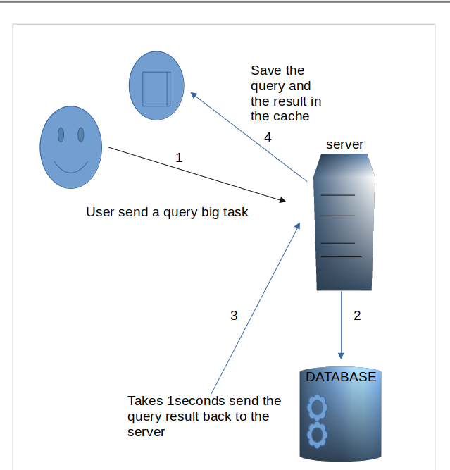
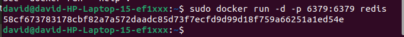

# Caching Proccess Django #
    To cache something is to save the result of an expensive calculation
    so that you don’t have to perform the calculation next time. Here’s 
    some pseudocode explaining how this would work for a dynamically generated 
    web page.

   

    If the user sends another petiton to the server, the server will look up if that petiton is
    the same as the previous by comparing the queries generated and the queries in the cache. If 
    they are the same, then I will send the data back to the client from the cache.

    Avoind calling again the database and reducing the time response back to the client.

  ## What Happen if the data in the database is update, it won't update the data in the cache? ##
    
    To solve that, when we store information in the cache, we can put an expiration time; after the
    first minute, the query (x) will be updated or deleted; after 1 second, the query (y) will be updated. 
    It depends on how often the user goes to need this data. 

   ```Cache Control```:Django provides decorators and APIs to control caching behavior. You can specify
     cache expiration times, cache keys, and conditional caching.
     
   ## Benefits of Caching ##

   ```Improved Performance```: Reduces database load and response times.

   ```Scalability```: Handles increased traffic by offloading processing to the cache.
   
   ```Reduced Server Load```: Decreases CPU and memory usage.
  
   ```Better User Experience```: Faster page load times and improved responsiveness.

   It's important to carefully evaluate the trade-offs between the potential benefits and
   drawbacks of caching for your specific application before implementing it.
  
  # List of Cache Backends # ([DJANGO](https://docs.djangoproject.com/en/5.0/topics/cache/))
   - Local Memory (Default) not good choice for Production
   - Memcached
   - Redis
   - Database (Yes you can use tables like memory Cahche)
   - File System 

    I gonna use Redis for this Cdocumentation, in the future we will add more documentation using other Cache backend:
     
## List of Commands ##
1. Run the next command to make sure
that we have installed docker with 
redis:
`docker run -d -p 6379:6379 redis:`.

        
    ## Commands Defination: 
    `run`:
        It wil trigger the method
  
    `-d`:
        The -d flag runs the container in detached mode. This means the container will run in the background and you'll return to the command prompt immediately.
  
    `-p`:
      The -p flag is used to publish a container's port to the host. In this case:

      - 6379 is the port number inside the container 
        (where Redis is listening).
            
      - 6379 is the port number on the host machine 
        that will   be mapped to the container's port.

        This means that any connection made to port 6379 on your host machine will be forwarded to port 6379 inside the container.
                
    `redis`:
      - This specifies the name of the Docker image to use.
        In this case, it's the official Redis image.

2. Installing `pip install django-redis` Redis as a cache backend for Django is used to improve application performance by storing frequently accessed data in memory. 

    **Redis, an in-memory data structure store, is an excellent choice for Django's cache backend due to its**:

    - **High performance**: Redis stores data in memory,
       enabling extremely  fast read and write operations.
    - **Flexibility**: It Offers various data structures
      beyond simple key-value storage allowing for complex caching strategies.
    
    - **Scalability**: Redis can handlea high volume
      of request, making it suittable for large-scale application.
    
    - **Integration**: Django provides built-in support
      for redis as a cahce backend.

    ***Configure as cache backend***
      To start using django-redis we need to change the 
      setting.py adding something like:  
      ```setting.py```
      ```py
        CACHES = {
            "default": {
                "BACKEND": "django_redis.cache.RedisCache",
                "LOCATION": "redis://127.0.0.1:6379/2",
                "OPTIONS": {
                    "CLIENT_CLASS": "django_redis.client.DefaultClient",
                }
            }
        }
      ```
    ***Configure as session backend***
    A session backend is essentially the storage mechanism used 
    by Django to maintain user-specific data across multiple HTTP
    requests.

    `Session creation`: When a user visits a website for the first time, a unique 
    session ID is generated and stored in a cookie on the user's browser.
        
    `Data storage`: The actual session data (like user preferences, shopping cart
    items, authentication status) is stored on the server-side, indexed by the
    session ID.
        
    `Data retrieval`: On subsequent requests, Django retrieves the session data basedon the session ID stored in the cookie.

    **Default backend Django**:
    Django's default session backend uses a database to store session data. This is considered secure but can impact performance for high-traffic applications.
    
    `settings.py`
    ```py
       SESSION_ENGINE = "django.contrib.sessions.backends.cache"
       SESSION_CACHE_ALIAS = "default"
    ```
    # Using Low level Cache API #

    ```py 
      from django.core.cache import cache
      from requests import get

      def action_hello(req:Request):
          KEY_CACHE = "httpbin"
          if not cache.get(KEY_CACHE):
              print("FROM CACHE")
              # store cache informaction #
              request = get('https://httpbin.org/delay/2') # It has a delay 2s
              response = request.json()
              cache.set(KEY_CACHE, response, timeout=60) # data will be store for 60 seconds
          return render(req, 'hello.html', {'name':cache.get(KEY_CACHE)})
     ```
     Here we use https://httpbin.org to simulate a big process request that has a delay of 2 seconds, which means an issue affects the performance of a real application.

     After that the request is processed, it will store the result in the cache with a timeout of `60 seconds`. If the user sends another request at the same end point before the 60 seconds, it will take the data from the cache, avoiding the request of a delay of 2 seconds otherwise it will call the api again with a delay of 2 seconds.

     
     # USING DJANGO CACHE DECOREATOR #
     The cache_page decorator in Django is a powerful tool for improving the performance of your web application by caching the output of view functions.
     
     This means that when a user requests a page, Django checks if there's a cached version available. If so, it serves the cached content instead of re-running the entire view logic, significantly reducing response times

     BUT THIS JUST BASED IN WEB APPLICATION

     ```py
      from dajngo.views.decoratos.cache import cache_page

      @cache_page(60) # Means 60 seconds
      def action_hello(req:Request):
          request = get('https://httpbin.org/delay/2')
          response = request.json()
          return render(req, 'hello.html', {'name':response})

     ```
     It will create automatically a name for the cache key based in that 
     function `action_hello`, when will call it again it will look up
     for that name if exists it will add the result in the response
     without to calling the api again.
   

     # BASED IN CLASS VIEW #
     But in the real world we're going to work with class view, so the question is, how can we archive the same thing using class view?

     ```py 
      import request
      class action_hello(APIview):
           @cache_page(60) # Means 60 seconds
           def get(self):
             req = request.get('https://httpbin.org/delay/2')
     ```
     
     If we use it in this way, it will throw an error. Why?  because function decorator does not work with method decorator of a class view.

     **for that we use the method_decorator**
     It just work for methods.
     
     `method_decorator` is a utility function in Django that allows 
     you to apply function-based decorators to methods of class-based
     views.
     
     ```py 
      import request
      from django.utils.decorators import method_decorator

      class action_hello(APIview):
           @method_decorator(cache_page(60)) # Means 60 seconds
           def get(self):
             req = request.get('https://httpbin.org/delay/2')
     ```
     it will works as the previes views function.

     # Working With Redis Cache Content #

     A Docker container is like a virtual machine, but it's lighter and faster.

     - Think of a virtual machine as a whole computer packed into a suitcase. It
       includes everything: the operating system, applications, and all the bells
       and whistles.

       - When we run the ```docker ps``` it
         will show you the active container.

       - As those container are like virtual
         machine, we can exc commands on it.

       - ```sudo docker exec -it 58cf67378317 redis-cli```
          *exec*:Execute command
          
          *-it*: Interative

          *redis-cli*: The command that we want execute
          inside this container.([redis-cli doc](https://redis.io/docs/latest/develop/connect/cli/))

     