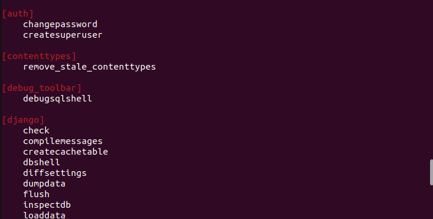

# What is base command in Django?
 BaseCommand is a Django object for creating new Django admin commands 
 that can be invoked with the manage.py script. The Django project team 
 as usual provides fantastic documentation for creating your own commands.

 

 Every single app installed in Django has its own command customization,
 allowing you to perform some action based on a command.

 Like Auth on the example above: 
 ```
 [auth]
    changepassword
    createsuperuser

 ```

Applications can register their own actions with manage.py. For example, you might want to add 
a manage.py action for a Django app that you’re distributing. In this document, we will be building 
a custom command for the store application from the tutorial.

         ```
         store/
            __init__.py
            models.py
            management/
               __init__.py
               commands/
                     __init__.py
                     populate.py
            tests.py
            views.py
         ```
 The `populate.py` module has only one requirement – it must define a class Command that extends 
 ``BaseCommand`` or one of its subclasses E.i:
   
   ```.py
      from django.core.management.base import BaseCommand
      from django.db import connection
      from pathlib import Path
      import os

      class Command(BaseCommand):
         help = 'It will populate the collection table'

         def handle(self, *args, **options) -> str | None:
               print("Populating Collection Table....")
               current_dir =os.path.dirname( __file__)
               file_path = os.path.join(current_dir, 'queryInsert.sql')
               sql = Path(file_path).read_text()
               with connection.cursor() as cursor:
                  cursor.execute(sql=sql)
   ```
   There is a lot more that you can implement using custom commands in  Django.
   documentation:  https://docs.djangoproject.com/en/5.0/howto/custom-management-commands/
   
   