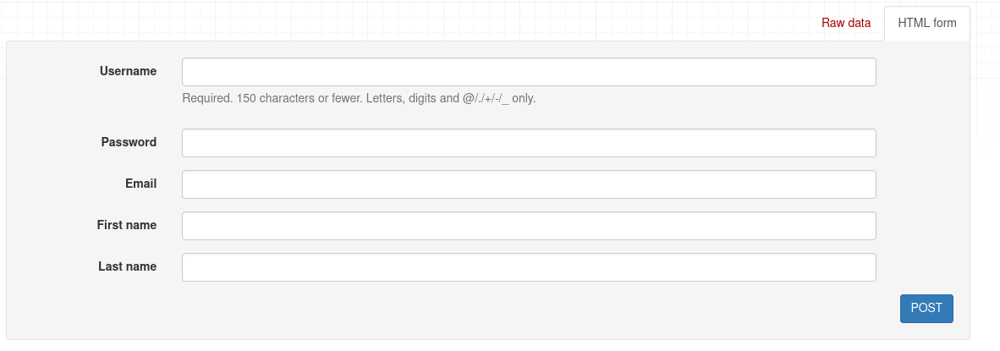

# Authentication System #
 The authentication hook allows checking for a 
 username and password pair in an external
 system.
  
 1. User Login:
    The user enters their credentials (username/password, email/password, etc.)
    into a login form on the client-side (usually a web page or mobile app).

 2. Hook Functionality:
    ## The hook performs the following actions: ##
    `Data Collection`: It retrieves the username and password entered by the user.
    `API Call`: It sends an HTTP request (usually a POST request) to a designated endpoint on the server containing the user's credentials.
     This endpoint is typically part of a RESTful API provided by the backend.

    `Handling Response`: The hook waits for the server's response, which could be
      `Success`: The server validates the credentials and sends back an authentication token (e.g., JWT) or a success message.
      `Failure`: The server sends back an error message indicating invalid credentials or other authentication issues.

4. Token Storage (Optional):
    If the authentication is successful and a token is received, the hook might store it securely in the client-side storage 
    (e.g., local storage, session storage, cookies with appropriate security measures).

## Djoser ##
- Djoser is a popular Django library that simplifies the process of implementing
  secure and robust authentication functionalities in your Django REST framework
  (DRF) APIs. It provides a collection of generic views and functionalities that
  handle common user management tasks like registration, login, password reset, 
  and account activation.

- This avoding us to hard-tasking processes, in developing those endpoints and
  follow all the rule of security convention.

  `django.contrib.auth` is a built-in Django application that serves as the cornerstone for user authentication and authorization in your web applications.
   It provides a comprehensive set of features to manage users, groups, and permissions, ensuring secure access control within your project.

  These are the table for thre auth app:
  '

## MIDDLEWARE ##
  In web development frameworks like Django or Express.js (for Node.js), middleware acts as an intermediary between the web server and the application
  code. It's essentially a chain of software components that have the ability to intercept, modify, and extend HTTP requests and responses as they travel through 
  the application stack. This allows you to implement common functionalities or security measures across your entire application in a centralized and reusable manner.

  Let's take this simple example: the user sends a request, and at the time that the user sends the request, the response must retrieve some information about that user, like name, type, authentication, etc. The request must retrieve all the information from a single object, say: 

  
  
  e.i
  ```.py
   # CART ITEMS # 
   class CartItemsModelVIew(ModelViewSet):
      
      def get_queryset(self):
         return CartItem.objects.select_related('product').all().filter(cart_id=self.kwargs['cart_pk'])
      
      def get_serializer_class(self):
         print(self.request.user) # admin
         if self.request.method =='POST':
            return CartItemsSerializerPost
         elif self.request.method == 'PUT':
            return CartItemsSerializerPatch
         return CartItemsSerializer

      def get_serializer_context(self):
         return {
            'request': self.request,
            'uui_id': self.kwargs['cart_pk']
         }
  ```
  But this is just a simple example; we can retrieve more data from each single user.

 ## Common Middleware Examples (Django): ##

   `SessionMiddleware`: Enables session management, allowing you to store user data across multiple requests.
   
   `AuthenticationMiddleware`: Associates authenticated users with requests, making user information accessible in views.
   
   `CommonMiddleware`: Handles common tasks like basic authentication, redirecting based on trailing slashes, and setting secure cookies 
   (with appropriate security settings). Custom Middleware (Example: LoggingMiddleware): You can create custom middleware to perform specific
   tasks across your application. For instance, a LoggingMiddleware can log all requests and responses for debugging or audit purposes.

   ```.py
      MIDDLEWARE = [
      'debug_toolbar.middleware.DebugToolbarMiddleware',
      'django.middleware.security.SecurityMiddleware',
      'django.contrib.sessions.middleware.SessionMiddleware',
      'django.middleware.common.CommonMiddleware',
      'django.middleware.csrf.CsrfViewMiddleware',
      'django.contrib.auth.middleware.AuthenticationMiddleware',
      'django.contrib.messages.middleware.MessageMiddleware',
      'django.middleware.clickjacking.XFrameOptionsMiddleware', 
      ]
   ```

  `django.middleware.clickjacking`: Django provides a middleware class named XFrameOptionsMiddleware that specifically addresses
   a security vulnerability known as clickjacking.

 ## How XFrameOptionsMiddleware Protects Against Clickjacking: ##

 1. This middleware sets the X-Frame-Options HTTP header in the response.
 - The X-Frame-Options header can have different values to control how the browser handles the response when it's loaded within a frame:
      `DENY (default)`: Prevents the response from being loaded in any frame, regardless of the origin (website) attempting to load it. This is the most secure option.
      `SAMEORIGIN`: Allows the response to be loaded within a frame only if the origin of the frame matches the origin of the response itself. This provides more flexibility while still offering some protection.
      `ALLOW-FROM <uri>`: Allows the response to be loaded within a frame only if the origin of the frame matches the specified URI. This is the least secure option and should be used cautiously.
   
   As you can see, all those actions  in the middleware happen in the bridge of data between the client and the server.


# CUSTOMIZING THE USER MODEL #

  Django provides a built-in User model within the `django.contrib.auth.model` application. However, you can often extend this model to add additional fields 
  specific to your application's needs. Here's a breakdown of the approaches and considerations for customizing the user model:

   ```.py
      class AbstractUser(AbstractBaseUser, PermissionsMixin):
         """
         An abstract base class implementing a fully featured User model with
         admin-compliant permissions.

         Username and password are required. Other fields are optional.
         """

         username_validator = UnicodeUsernameValidator()

         username = models.CharField(
            _("username"),
            max_length=150,
            unique=True,
            help_text=_(
                  "Required. 150 characters or fewer. Letters, digits and @/./+/-/_ only."
            ),
            validators=[username_validator],
            error_messages={
                  "unique": _("A user with that username already exists."),
            },
         )
         first_name = models.CharField(_("first name"), max_length=150, blank=True)
         last_name = models.CharField(_("last name"), max_length=150, blank=True)
         email = models.EmailField(_("email address"), blank=True)
         is_staff = models.BooleanField(
            _("staff status"),
            default=False,
            help_text=_("Designates whether the user can log into this admin site."),
         )
         is_active = models.BooleanField(
            _("active"),
            default=True,
            help_text=_(
                  "Designates whether this user should be treated as active. "
                  "Unselect this instead of deleting accounts."
            ),
         )
         date_joined = models.DateTimeField(_("date joined"), default=timezone.now)

         objects = UserManager()

         EMAIL_FIELD = "email"
         USERNAME_FIELD = "username"
         REQUIRED_FIELDS = ["email"]

         class Meta:
            verbose_name = _("user")
            verbose_name_plural = _("users")
            abstract = True

         def clean(self):
            super().clean()
            self.email = self.__class__.objects.normalize_email(self.email)

         def get_full_name(self):
            """
            Return the first_name plus the last_name, with a space in between.
            """
            full_name = "%s %s" % (self.first_name, self.last_name)
            return full_name.strip()

         def get_short_name(self):
            """Return the short name for the user."""
            return self.first_name

         def email_user(self, subject, message, from_email=None, **kwargs):
            """Send an email to this user."""
            send_mail(subject, message, from_email, [self.email], **kwargs)
   ```
   We can create a user Aunthentication app, and in that app, we can add the 
   model to inheritance from the class above, allowing us to modify the 
   Aunthentication model user in Django. for e.i making the user email as unique.

   ```.py
   from django.contrib.auth.models import AbstractUser
   from django.db import models

   # Create your models here.

   class Users(AbstractUser):
      email = models.EmailField(unique=True)
      
   ```
   Further, we need to configure the setting project, making that model
   the new authentication model in the setting.py file of the project.

    `AUTH_USER_MODEL='app.modelClass' # AUTH_USER_MODEL #`
    `AUTH_USER_MODEL='paerty.Users' # AUTH_USER_MODEL #`

   ```.py
   
      """
      Django settings for storefront project.

      Generated by 'django-admin startproject' using Django 3.2.3.

      For more information on this file, see
      https://docs.djangoproject.com/en/3.2/topics/settings/

      For the full list of settings and their values, see
      https://docs.djangoproject.com/en/3.2/ref/settings/
      """

      from pathlib import Path

      # Build paths inside the project like this: BASE_DIR / 'subdir'.
      BASE_DIR = Path(__file__).resolve().parent.parent


      # Quick-start development settings - unsuitable for production
      # See https://docs.djangoproject.com/en/3.2/howto/deployment/checklist/

      # SECURITY WARNING: keep the secret key used in production secret!
      SECRET_KEY = 'django-insecure-hs6j037urx6iav+7#10%-vu4l4f5@@-1_zo)oft4g7$vf2$jmp'

      # SECURITY WARNING: don't run with debug turned on in production!
      DEBUG = True

      ALLOWED_HOSTS = []

      AUTH_USER_MODEL='party.Users' # AUTH_USER_MODEL #

      # Application definition #

      INSTALLED_APPS = [
         'django.contrib.admin',
         'django.contrib.sessions',
         'django.contrib.auth',
         'django.contrib.contenttypes',
         'django.contrib.messages',
         'django.contrib.staticfiles',
         'rest_framework',
         'debug_toolbar',
         'django_filters',
         'playground',
         'store',
         'tags',
         'likes',
         'party',
      ]
      ....
   ```
 - # Explaining the django.contrib APP: #

    In Django, the ``contrib`` module (or package) is a collection of optional, reusable applications that 
    provide various functionalities to extend the core framework. These applications are not essential for
    building a basic Django web application, but they offer a wide range of features that can save you time 
    and effort in development.

    The contrib module in Django is indeed built and maintained by the Django development team itself. It's an 
    official part of the Django framework in other words is dependicy of django itself.

    
     
    For example, when we use the admin panel (the app admin dashboard), we have access to many tools like editing 
    groups and creating users, but before that, we need to register the model in the admin panel or in that app's
     `admin.register` class.

     `([party]admin.py)`
     ```.py 
      from django.contrib import admin
      from django.contrib.auth.admin import UserAdmin 
      from django.contrib.contenttypes.admin import GenericTabularInline

      from store.models import Product
      from store.admin import ProductAdmin

      from tags.models import TaggedItem

      from . import models


      admin.register(models.Users)
      class SuperUser(UserAdmin):
         pass
     ```

    Just thinks of the dashboard from (admin app like) an app like ('store', 'tag') this
    app has access to templates whos allow you to see the interface as the code above.
    

    
    
    ```.py

         INSTALLED_APPS = [
         'django.contrib.admin',
         'django.contrib.sessions',
         'django.contrib.auth',
         'django.contrib.contenttypes',
         'django.contrib.messages',
         'django.contrib.staticfiles',
         'rest_framework',
         'debug_toolbar',
         'django_filters',
         'playground',
         'store',
         'tags',
         'likes',
         'party'
      ]
    ```
 

 - # GROUP AND PREMISSION DJANGO ##
  Permissions in Django complement groups by providing granular
  control over what actions a user can perform within the 
  application.

  In Django, it follows the philosophy that a group is a collection 
  of premissions; each group has a different premission. Let's say 
  that group number one has the privilege to (edit, write and read)  
  and Group number two has the permission to read only. Those groups
  have different users and those users inherit the privileges of those 
  groups.

  - ## CREATING A CUSTOM PREMISSION IN DJANGO ## 
 ```.py
   class Order(models.Model):
    PAYMENT_STATUS_PENDING = 'P'
    PAYMENT_STATUS_COMPLETE = 'C'
    PAYMENT_STATUS_FAILED = 'F'
    PAYMENT_STATUS_CHOICES = [
        (PAYMENT_STATUS_PENDING, 'Pending'),
        (PAYMENT_STATUS_COMPLETE, 'Complete'),
        (PAYMENT_STATUS_FAILED, 'Failed')
    ]

    placed_at = models.DateTimeField(auto_now_add=True)
    payment_status = models.CharField(
        max_length=1, choices=PAYMENT_STATUS_CHOICES, default=PAYMENT_STATUS_PENDING)
    customer = models.ForeignKey(Customer, on_delete=models.PROTECT)
    
    class Meta:
        premission = [
            ('cancel_order', 'Can cancel Order')
        ]
   ```.py

   ```.py
      class Meta:
         premission = [
               ('premission_name', 'Premission Description')
         ]
   ```
   # Securing API #
    
   ``` |
       |
       +------TOKEN: fspoksf5868468sesiolifs57585se7fssofkp55osepofk5757      
   ```
   Let's take, for example, www.youtube.com. At the time that you log in, it generates a token. This token is like a unique key generated by the server. The server stores this key temporarily; this key is passed to the client in the browser, and the browser stores this key in the cache (this not the normal cache). So, at the time that you want to log in to the same machine, you do not have to puch your credentials again because you already have a key. 
   
   This's how system credentials in many software programs and apps work today.

   # Authentication Backends #
   In Django's authentication system, authentication backends are the workhorses that handle the critical 
   task of verifying user credentials during login attempts. They act as intermediaries between your
   application and the source of truth for user data 
   
   - Token-Based Authentication 
   - JSON Web Token (JWT) Authentication 
   
   Both token-based authentication and (JWT) authentication are methods for securing 
   access to web applications without storing user credentials (like passwords) 
   on the server after a successful login.
   
   # Token-Based Authentication: #

   *Concept*: Is an umbrella term for any approach using tokens for authentication. It offers flexibility in token format and validation approaches.

   *Token Structure*: Can be any format containing user information or claims that identify the user and potentially their access rights.

   *Security*: Relies on the server-side validation of the token and proper storage mechanisms (e.g., HttpOnly cookies) on the client-side to prevent unauthorized access.

   *Flexibility*: Can be implemented with various token formats and validation mechanisms to suit specific needs.

   *Example*: A simple token could be a random string generated by the server and associated with a user session in a database. The server validates the token by looking up the corresponding session data.

  # JSON Web Token (JWT): (Used in this documentation) #
   ``` Instalation:
   https://djoser.readthedocs.io/en/latest/authentication_backends.html
   ```

   *Concept*: Is a specific type of token-based authentication that uses a standardized JWT format with cryptographic signing for added security and ease of use.
   
   *Token Structure*: A standardized format consisting of three Base64 encoded parts: header, payload, and signature.
   
   *Header*: Defines the token type (JWT) and signing algorithm.
   
   *Payload*: Contains user information (claims) like user ID, username, roles, etc. This data is not encrypted but verifiable.
   
   *Signature*: Ensures the data hasn't been tampered with by signing the header and payload with a server-side secret key.
   
   *Security*: Relies on the cryptographic signature to ensure data integrity and the server's secret key for verification.
   
   *Standardization*: Benefits from a well-defined structure and supported libraries/frameworks for easier implementation across different platforms.
   
   *Transparency*: The payload contains user information, which can be useful for authorization decisions but might also be a privacy concern in some cases.
   
# User Registration #
   When the user is registering at the time that we send the request to process 
   the data, we need to make a few things under the hook, like the store username 
   and validation field. We can even personalize the data that we want to store 
   from our user.
   
   

   We can overwrite the user behivor in the serializer, but how?

   We are going to specify to the user that the username must start with `@` and be
   unique, already (djoser has this preference, but we are going to make a few modifications
   overwrite them). 

   ``party.models``
   ```.py

   from django.contrib.auth.models import AbstractUser
   from django.utils.translation import gettext_lazy as _
   from django.db import models
   from django.contrib.auth.validators import UnicodeUsernameValidator 

   # Create your models here.
   class Users(AbstractUser):
         email = models.EmailField(unique=True)     
         username_validator = UnicodeUsernameValidator()

         username = models.CharField(
               _("username"),
               max_length=150,
               unique=True,
               help_text=_(
                     "Required. 150 characters or fewer. Letters, digits and @/./+/-/_ only. and @username"
               ),
               validators=[username_validator],
               error_messages={
                     "unique": _("A user with that username already exists."),
               },
         )

   ```
   

   ``party.serializer``
   ```.py
   from rest_framework import serializers
   from djoser.serializers import UserCreateSerializer as BaseUserCreateSerializer

   class UserCreateSerializer(BaseUserCreateSerializer):
      # value as arguments.#
      
      def validate_username(self, value:str):
            if value.startswith('@') == False:
               raise serializers.ValidationError(f'The User Name must start with @')
            return value
      
      class Meta(BaseUserCreateSerializer.Meta):
         fields = ['username', 'password', 'email', 'first_name', 'last_name']
   ```
   
   

# Login #

   In this case, we are using JWT, so when we send the credential, it will rerun
   two different tokens: the [access token, refresh token].
   
   

   The ``access`` token will be the key that we use to get access to all the endpoints. 
   When the access token expires, you need to get a new refreh of the token, and for that, you need
   to use the refresh token. Using algorithms (HS256) and math calculations based on the 
   ``refresh token``, we receive the access to refresh the access token. In this 
   case, you have:

   ``refresh token``: (23 + 12 + 23 / 23 + 12 + 01)
   ``Access token``: 2088

   If We change the refresh token then We wont get access to the ``main access`` token again.

# A JSON Web Token or JWT is made up of three parts: #

   ``The header``: contains some metadata about the token itself.
   ``The payload``: contains the data that we want to encode into the token, so the more data we want to encode here the 
     bigger is the JWT.
   ``The signature``.

   
   These first two parts, the ``header`` and the ``payload``, are 
   just plain text that will get encoded, but not encrypted.

   **So anyone will be able to decode them and read them, we cannot store any sensitive** 
   **data in here**. But that's not a problem at all because in the third part, the ``signature``,
   is where things really get interesting.
   
   

   The ``signature`` is created using the`header`, the
   `payload`, and the secret that is saved on the server.

   And this whole process is then called `signing the Json Web Token`. The signing algorithm takes the
   `header`, the `payload`, and the `secret to create a unique signature`. So only this data plus the secret 
   can create this signature. Then together with the header and the payload, these signature forms the
   JWT, which then gets sent to the client. 
   
   

    Once the server receives a JWT to grant access to a protected route, it needs to verify it in order to determine if the user really is who he claims to be. In other words, it will verify if no one changed the header and the payload data of the token. So again, this verification step will check if no third party actually altered either the header or the payload of the Json Web Token.

   ```       0joijzscj09hiznoc
      +---------+ token +---------+
      | Client  | ----> | Server  |
      +---------+       +---------+

      it will generate a token based i
      n the headerthe token must to 
      be the same sent by de client    

   ```
   So, how does this verification actually work? Well, it is actually quite straightforward. Once the JWT is received, the verification will take its header and payload, and together with the secret that is still saved on the server, basically create a test signature.
   
   But the original signature that was generated when the JWT was first created is still in the token, right? And that's the key to this verification. Because now all we have to do is to compare the test signature with the original signature. And if the test signature is the same as the original signature, then it means that the payload and the header have not been modified. 

   

   Because if they had been modified, then the test signature would have to be different. Therefore in this case where there has been no alteration of the data, we can then authenticate the user. And of course, if the two signatures are actually different, well, then it means that someone tampered with the data.

   But that third party manipulating the payload does of course not have access to the secret, so they cannot sign the JWT. So the original signature will never correspond to the manipulated data. And therefore, the verification will always fail in this case. And that's the key to making this whole system work. It's the magic that makes JWT so simple, but also extremely powerful.

   
   
   At the time of production, it is important to hide this key: **DO NOT GO TO PRODUCTION WITHOUT HIDE IT. It can be a big vulnerability**. 


   JWT using it:
   

   # Getting Current User's Profile # 
   When we are logged in with some credentials, as we said before, 
   it will retrieve two tokens.
   
   In the customer table of the store app, we need to make the relationship
   with the user, but how can we do that? We need a referral from our user 
   to make the related ID with the right user in other word find the user 
   id that we want.
   
   
   

   For now the only user that we have is the admin user (id=1):
    

   This user data (used_id) is stored in the pyloed of our token, which 
   we have stored in the local memory of our client.
   
   

   This token already was proccessed by the middleware. 
   ```.py
      MIDDLEWARE = [
      'debug_toolbar.middleware.DebugToolbarMiddleware',
      'django.middleware.security.SecurityMiddleware',
      'django.contrib.sessions.middleware.SessionMiddleware',
      'django.middleware.common.CommonMiddleware',
      'django.middleware.csrf.CsrfViewMiddleware',
      'django.contrib.auth.middleware.AuthenticationMiddleware'# <--,
      'django.contrib.messages.middleware.MessageMiddleware',
      'django.middleware.clickjacking.XFrameOptionsMiddleware',
   ]
   ```
   The ``@action`` decorator in Django REST framework allows you to define custom 
   actions within your viewsets. These custom actions become separate endpoints 
   in your API that can be used to perform specific functionalities beyond the
   standard CRUD (Create, Read, Update, Delete) operations.

   
   
   ``E.i:``
    ``.py
      from rest_framework.decorators import action
      from rest_framework.response import Response
      from rest_framework.request import Request

      # Customer Model view #
      class CustomerView(mixins.CreateModelMixin,
                     mixins.RetrieveModelMixin,
                     mixins.UpdateModelMixin,
                     mixins.DestroyModelMixin,
                     GenericViewSet
                     ):
      
      queryset = Customer.objects.all()
      serializer_class = serializer.CustomerSerializer
      
      @action(detail=False, methods=['GET','PUT'])
      def me(self, req:Request):
            return Response(f"Hi the user id is {req.user}")
   ``
  
   # Working With Permission # 

    In Django, permissions are a way to control user access to specific 
    functionalities within your application. They act as a security layer,
    ensuring that only authorized users can perform certain actions.

   - *** Benefits of Using Permissions ***:
   `Granular Control`: Grants fine-grained access control based on specific permissions.
   `Improved Security`: Limits unauthorized access to sensitive parts of your application.
   `Code Maintainability`: Helps keep your code organized and easier to manage as your application grows.

   ``permission.py``
   ```.py
     from rest_framework.response import Response
     from rest_framework.request import Request
     from rest_framework import permissions
     from rest_framework.permissions import SAFE_METHODS
     
     class IsAdminUserOrReadOnly(permissions.BasePermission):
         """
           Allows access only to admin users and read only.
         """
         def has_permission(self, request:Request, view):
               if request.method in SAFE_METHODS:
                   return True  
               return bool(request.user and request.user.is_staff)
   ```
  
  # DjangoModelPermissions #
  This permission class ties into Django's standard `django.contrib.auth` model permissions.

  

  

  ```.py
  class DjangoModelPermissions(BasePermission):
    """
    The request is authenticated using `django.contrib.auth` permissions.
    See: https://docs.djangoproject.com/en/dev/topics/auth/#permissions

    It ensures that the user is authenticated, and has the appropriate
    `add`/`change`/`delete` permissions on the model.

    This permission can only be applied against view classes that
    provide a `.queryset` attribute.
    """

    # Map methods into required permission codes.
    # Override this if you need to also provide 'view' permissions,
    # or if you want to provide custom permission codes.
    perms_map = {
        'GET': [],
        'OPTIONS': [],
        'HEAD': [],
        'POST': ['%(app_label)s.add_%(model_name)s'],
        'PUT': ['%(app_label)s.change_%(model_name)s'],
        'PATCH': ['%(app_label)s.change_%(model_name)s'],
        'DELETE': ['%(app_label)s.delete_%(model_name)s'],
    }

    authenticated_users_only = True

    def get_required_permissions(self, method, model_cls):
        """
        Given a model and an HTTP method, return the list of permission
        codes that the user is required to have.
        """
        kwargs = {
            'app_label': model_cls._meta.app_label,
            'model_name': model_cls._meta.model_name
        }

        if method not in self.perms_map:
            raise exceptions.MethodNotAllowed(method)

        return [perm % kwargs for perm in self.perms_map[method]]

    def _queryset(self, view):
        assert hasattr(view, 'get_queryset') \
            or getattr(view, 'queryset', None) is not None, (
            'Cannot apply {} on a view that does not set '
            '`.queryset` or have a `.get_queryset()` method.'
        ).format(self.__class__.__name__)

        if hasattr(view, 'get_queryset'):
            queryset = view.get_queryset()
            assert queryset is not None, (
                '{}.get_queryset() returned None'.format(view.__class__.__name__)
            )
            return queryset
        return view.queryset

    def has_permission(self, request, view):
        if not request.user or (
           not request.user.is_authenticated and self.authenticated_users_only):
            return False

        # Workaround to ensure DjangoModelPermissions are not applied
        # to the root view when using DefaultRouter.
        if getattr(view, '_ignore_model_permissions', False):
            return True

        queryset = self._queryset(view)
        perms = self.get_required_permissions(request.method, queryset.model)

        return request.user.has_perms(perms)
  ```
  

  Django Auth gives this permission based on the permissions 
  that were allowed in the admin panel.

  This permission must only be applied to views that have in a queryset property or get_queryset() method. Authorization will only be granted if the user is *authenticated* and has the relevant model permissions assigned. The appropriate model is determined by checking get_queryset().model or queryset.model.

  I will allow the DjangoModelPermision how the class permission:
  
  ```.py
         # COLLECTION VIEW SECTION #
      class CollectionModelView(ModelViewSet):
         """DOCUMENTATION ABOUT THIS MODULE"""
         queryset = Collection.objects.all().annotate(products_counts=Count('product')) 
         permission_classes = [permisionCustom.DjanggoObjectsPermisions]
         ...
  ```


  in this case if we see it `mellisa` user does not have access to view the collection model, we have not yet given that permission.

  

  Now form the admin panel as administrator we are gonna give the permission:
  
  
  Let's try again:
   

   # Applying Custom Model Permission #

   We can apply our own custom permission based on the ``rest_framework.permission.BasePermission``,
   we can create a custom permission for customer history.

   ``store/model.py``
   We must first add the custom permission to 
   the customer's Meta Class in this case.
   ```.py
      class Customer(models.Model):
         MEMBERSHIP_BRONZE = 'B'
         MEMBERSHIP_SILVER = 'S'
         MEMBERSHIP_GOLD = 'G'

         MEMBERSHIP_CHOICES = [
            (MEMBERSHIP_BRONZE, 'Bronze'),
            (MEMBERSHIP_SILVER, 'Silvers'),
            (MEMBERSHIP_GOLD, 'Gold'),
         ]

         phone = models.CharField(max_length=255)
         birth_date = models.DateField(null=True, blank=True)
         membership = models.CharField(
            max_length=1, choices=MEMBERSHIP_CHOICES, default=MEMBERSHIP_BRONZE)
         
         user = models.ForeignKey(settings.AUTH_USER_MODEL, on_delete=models.CASCADE)


         def first_name(self):
            return self.user.first_name
         
         def last_name(self):
            return self.user.last_name
         
         class Meta:
            ordering = ['user__first_name', 'user__last_name']
            permissions = [
               ('view_history', 'Can view History') # Adding the custom permissions
            ]
   ```
   

   So it will add the new permission to the permission table, 
   referring to the id of the model as content_type in this
   case Customer Model.

   

   Now, if we search for permission in the panel admin, 
   it will appear:
    

   Now we need to create a custom permission to see if
   this permission is already adeed for that user:
   
    ```.py
      class HasPermissionHitory(permissions.BasePermission):
         """
         Allows access only to the user with this permissions
         """
         def has_permission(self, request:Request, view):
            print("Permission Checker:")
            return request.user.has_perm('store.view_history')
    ```
   
   If the user does not have this permission, when trying to enter
   the endpoint action, it will show a response error indicating
   authentication.:

    
   

   Let's give that permission from the admin panel:
    

   Let's try to access to the action end point again:
   

   This is how modelcustom permission works in Django.