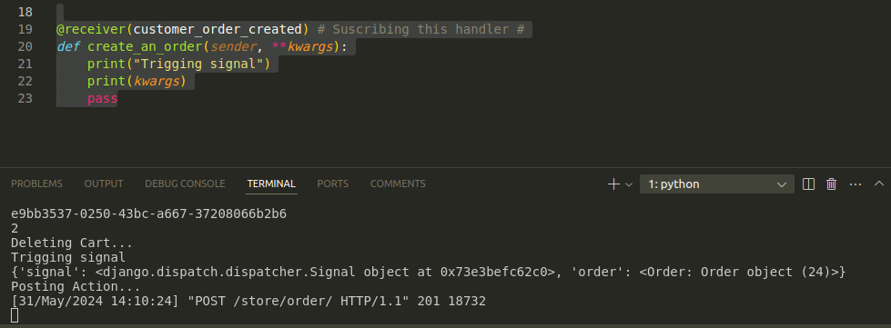

# Signals in Django #
Signals in Django are a powerful mechanism for communication between different parts of your application. They essentially act as a notification system that allows one component (sender) to notify other components (receivers) when a specific event occurs.

 # In Django our models have a bunch of permitions or notification that are fired in different times:

 *pre_save*: Is fire before the model is save.
 *post_save*: Is fire after the model is save.
 *pre_delete*: Is fire before the model is delete.
 *post_delete*: Is fire after the model is delete.

 ## In our application you can listing for those notification and do something ##:
 Let's say that we want to raise a signal between two different apps. The app (A) can raise a signal to the app (B) when we create a new user in the (A) app using the *post_save* signal.

 # Creating signals: # 
   1.  First we create a file called: `signals.py` in our (A) app.
   2.  Add a function to the receiver decorator.
       e.i:
       ```.py
              
              from django.conf import settings
              from django.db.models.signals import post_save
              from django.dispatch import receiver

              from . import models

              # When we create a post in sender (module), it will trigger

              @receiver([post_save],sender=settings.AUTH_USER_MODEL)
              def create_refer_in_customer_with_userid(sender,**kwargs):
                    print("Trigging signal")
                    print(kwargs)
                    if kwargs['created']:
                        models.Customer.objects.create(user=kwargs['instance'])
            

       ```

   3. We'll need to import the signal file into the app.py file in the ready method of
      StoreConfig class:

      ```.py 
          class StoreConfig(AppConfig):
              default_auto_field = 'django.db.models.BigAutoField'
              name = 'store'

              def ready(self) -> None:
                  import store.signals
      ```  
      Of our app, so it can be registered. The reason the signals are imported here is because Django will not import the signals if you do not import those explicitly. If the signals module is not imported, then the signals are not registered on the corresponding models, and hence if you for example make changes to your User model, the signals will not be triggered.
  
        inf: https://stackoverflow.com/questions/58362534/i-m-confused-about-the-ready-function-used-inside-app-py
      
      Under the hook, the receiver decorator will basically take the `create_refer_in_customer_with_userid` function and add to it some additional parameters afther that it will add the `create_refer_in_customer_with_userid`  inside the sender, which is our model user.
 
  # Creating Customer Signals #
  Signals are used to perform any action on modification of a model instance. The signals are utilities that help us to connect events with actions. 
  
  For example, let's say that your app is going to send an order. It will invoke the save method at the time you save that order; in fact, after that, you can invoke another method. When the save method is invoked, the method that will be invoked will be a sender. The sender will send this action to the signal, and all the handlers subscribed to that signal will be invoked too. 
  
  Lest see an example:
   `signal/handler.py`
    ```.py
     def save(self, **kwargs):
        with transaction.atomic():
          print("Running Transaction Proccess....")

          cart_id = self.validated_data['cart_id'] # Get the cart id
          get_user_id = self.context['get_user_id'] # get the user id form customer 
          print(cart_id)
          print(get_user_id)
          # Getting Customer from User id  #
          (customer, created) = models.Customer.objects.get_or_create(user_id=get_user_id)
     
          # Create Order Table #
          order_customer_created = models.Order.objects.create(customer=customer)

          # filter the cartitems table #
          cartItems = models.CartItem.objects.select_related('product').filter(cart_id=cart_id)
      
          # Create OrdenItems Table # 
          order_items = [models.OrderItem(
               order=order_customer_created,
               product=cartItems.product,
               quantity=cartItems.quantity,
               unit_price=cartItems.product.unit_price
          ) for cartItems in cartItems]

          models.OrderItem.objects.bulk_create(order_items)
         
          # Delete Cart Row #
          print("Deleting Cart...")
          models.Cart.objects.filter(pk=cart_id).delete()

          # IT created a order send to Trigger Signal #
          signals.customer_order_created.send_robust(self.__class__, order=order_customer_created)
         
          return order_customer_created
    ```

   Now we can subscribe a handler to that signal:
   `store/signal/handler.py`

   ```.py 
    @receiver(customer_order_created) # Suscribing this handler #
    def create_an_order(sender, **kwargs):
        print("Trigging signal")
        print(kwargs)
        pass
   ```

   

 In other conclusion, Signals are used to perform some action on the modification/creation of a particular entry in the Database. For example, One would want to create a profile instance, as soon as a new user instance is created in Database as before.
  
    


