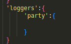
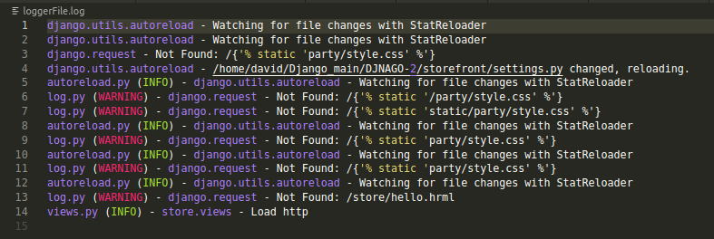
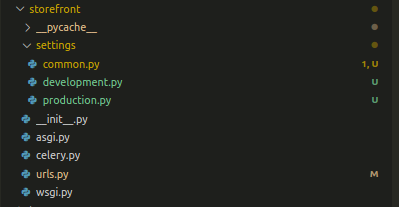
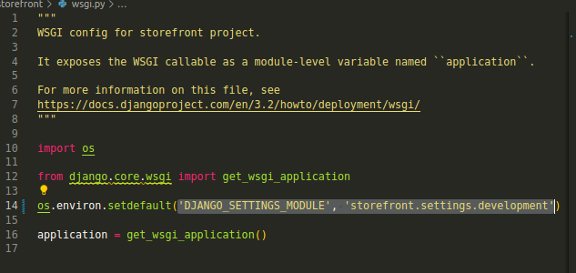
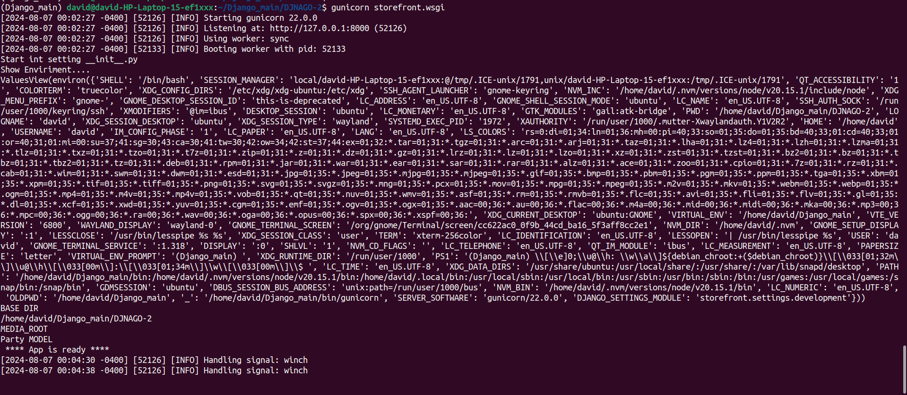

# Production Enviroment #
  Following the documentation Instruction, we look at some action, like
  building the home page, when we hit the root end point.
  
1. ## Creating Templates  dir in the party App ## 
    ``cd party``: Go to the Party App.

    ``mkdir templates``: create a directory called Templates.
    
    ``cd templates ``: Go to that directory.
    
    ``mkdir party``: create another directory called party.

2. ## Create Static File ## Production Enviroment #
  Following the documentation Instruction, we look at some action, like
  building the home page, when we hit the root end point.
  
1. ## Creating Templates  dir in the party App ## 
    ``cd party``: Go to the Party App.

    ``mkdir templates``: create a directory called Templates.
    
    ``cd templates ``: Go to that directory.
    
    ``mkdir party``: create another directory called party.

2. ## Create Static File ## 
  
    Static files are assets like `CSS`, `JavaScript`, `images` These files are
    typically placed in a directory named *static* within your Django project.

    ### How Django Handles Statis Files ###

      How does Django show those files in the frontend app.
      allowing the user to see them?
      
      Django employs a combination of file system operations,
      URL routing, and middleware to manage static files.

      #### STAGES PROCCESS ####
      
      - Django iterates through the `STATICFILES_DIRS` setting to locate `static` files within your
        project (It will look at all the static dir in your project of each app) filtering all the
        extention with  (CSS, JS, images, etc.).

      - The `collectstatic` management command gathers discovered static files into a single directory
        (specified by STATIC_ROOT). This is crucial for production environments Basically taking all the
        static directories of each app and putting all of them in just a single file.

        
      #### CONFIGURATION IN STACTIC FILE IN DEVELOPMENT & PRODUCTION ####

      - **DEVELOPMENT**
         - Django's development server can serve static files directly from the static directory. This
           is convenient for development purposes.
      
      - **PRODUCTION**
         - In production, it's recommended to use a dedicated static file server like Nginx or Apache.

         - Django provides a command, collectstatic, to gather all static files from various app
           directories into a single location (We said in the STAGES PROCCESS).

         - This collected static files directory can then be served by your web server. 

    ### Django Rol With Static Files ###
      - **Organize**: Static file within our project structure
      - **COLLECT**: Collec static file to a single directory 
      - **PROVIDE A URL PATTERN**: For access these Collected files
      
      **What does means this?**
        Django does not directly serve static file
        in production, this's a backend framework
        but there are some ways to make this possible

      Django's responsibility ends with preparing the static files for serving. Once collected, your web server takes over to deliver them to users. 
      
      ### Optional part ###

      WhiteNoise is a Python package that provides efficient serving of static files in Django applications. It's particularly useful for deployment to platforms like Heroku where you don't have direct control over the web server.
      
      [DOCUMENTATION](https://whitenoise.readthedocs.io/en/stable/django.html)
      
      *Basic Configuration*:
      
      ```pip install whitenoise```
        
      ```py  
        MIDDLEWARE = [
              # ...
              "django.middleware.security.SecurityMiddleware",
              "whitenoise.middleware.WhiteNoiseMiddleware",
              # ...
        ]
      ```

3. ## Configuring Loggin ## 
    Django provides a robust logging system built on top of Python's
    standard logging module. It offers flexibility and customization 
    to suit various application needs.

    In this explanation, we are going deep into the basics of Loggin 
    in Django, but there are a lot more things that you can learn. Take
    a look at the [DOCUMENTATION](https://docs.djangoproject.com/en/5.0/topics/logging/) for more information.
    
    ```py
      LOGGING = {
         'version':1,
         'disable_existing_loggers': False,
         'handlers':{
            'console':{
                 'class':'logging.StreamHandler',
            },

            'file':{
                'class':'logging.FileHandler',
                'filename': 'loggerFile.log',
                'formatter':'verbose'

            }
         },

         'loggers':{
              '':{
                'handlers':['console','file'],
                'level': os.environ.get('DJANGO_LOG_LEVEL','INFO')
               }
         },

         'formatters':{
              'verbose':{
                  'format':'{name} - {message}',
                   'style': '{'
              }
         }
      }
    ```
    ### DEFINATION OF SOME OF THE KEYS ###
    
    ```disable_existing_loggers```:

     By default, Django comes with some loggers automatically configured here you decided if you want use tham. Is good practice to keep this key False.
    
    ```handlers```:
       
     A handler is like a mail carrier for your log messages.

      **It decides where to deliver the message**:
      - To the console (like printing it on the screen)
      - To a file (saving it for later)
      - Or somewhere else (like sending it over the network)

    ```loggers```:
       
      You can send different kinds of mail (log messages) to different mailboxes (loggers). Each mailbox can have different rules about what kind of mail it accepts (log levels) and where to deliver the mail (handlers).
       
      

       Example it will all the log from the party app only.
    
    ```formatters```:
        [Doc](https://docs.djangoproject.com/en/5.0/topics/logging/#formatters)

      Ultimately, a log record needs to be rendered as text. Formatters describe the exact format of that text. A formatter usually consists of a Python formatting string containing LogRecord attributes; however, you can also write custom formatters to implement specific formatting behavio
          
      # Using Logger #

      You write down important events (like errors, warnings, or informational messages) in this diary. The logging module helps you decide what to write, where to write it, and how to format it.

      Think of it as sending messages. You create a message (log record), choose its importance level (DEBUG, INFO, WARNING, ERROR, CRITICAL), and decide where to send it (to the console, a file, or somewhere else)

      **In the previous step above, we worked on the format of the data. Here we write the data.**

      ```py 
        import logging
        logger_dir =  logging.getLogger(__name__)

        def action_hello(req:Request):
            logger.info("Load http")
            request = get('https://httpbin.org/delay/2')
            response = request.json()
            return render(req, 'hello.html', {'name':response})

      ```

      Now you can use the `logger_dir` to track all the action on that module.

    
      *It created the File Log*
      

# Managing Development and Production Settings #
 **In every application, we need to separate development from production settings.**
 
 *Why Separate Enviroments?*

  ```segurity```:

          Exposing sensitivi information like database credential or APII Keys 
          in a public development environment is a securiry risk.

   ```Performance```:
          
           Different enviroments often requiere different optimization
           for example,  you migh use caching or debugging tools in development
           that would hinder performance in production.

   ```Consistency```:

           Maintaining separate settings helps ensure that code behaves
           consistently across different enviroments.

  ## Common Approaches ##
  **There are several common ways to manage separate settings**:

  - ```Environment Variables```: Store sensitive information like database 
    credentials in environment variables, which are accessible during 
    runtime but not checked into version control.
    
  - ```Configuration Files```: Create separate configuration files for development
    and production. Load the appropriate file based on the environment.
    
    
  - ```Django's Built-in Settings```: Leverage Django's settings system to
    conditionally set different values based on the environment.

  **In this Documentation i gonna use the Second Aproache (Configuration Files)** 
  
  1. In the settings directory of your project, create a new directory named settings (the name doesn't really matter).
 
  2. Change the ```settings.py``` name created by django to ```common.py```

  3. Move that file in the directory created in step 1.
  
      

      - In ```production.py```, we pass the environment variable that must exist in production.
      
      - In ```development.py```, we pass the environment variable that must exist in production.

      - In ```production.py``` as ```development.py```, we import everything from ```common.py```


     ## File Settings Code ##

      
  ```development.py```:
  ```py
   from .common import * 
  
   DEBUG = True 
   SECRET_KEY = 'django-insecure-hs6j037urx6iav+7#10%-vu4l4f5@@-1_zo)oft4g7$vf2$jmp'

    #- Database -#
    # https://docs.djangoproject.com/en/3.2/ref/settings/#databases
    DATABASES = {
        'default': {
          'ENGINE': 'django.db.backends.postgresql_psycopg2',
            'NAME': 'DJANGO-34',
            'HOST': 'localhost',
            'USER': 'postgres',
            'PASSWORD': '1234'
        }
    }
   
  

  ```
  
  ```production.py```:
  ```py
   import os 
   from .common import * 
  
   DEBUG = False 
   SECRET_KEY = os.environ['SECRET_KEY']
   # SECURITY WARNING: don't run with debug turned on in production!
   ALLOWED_HOSTS =['server ip address']

  ```
# Using Gunicorn #

 **What the runserver command actually does**:

 - **Imports Django's built-in development server: This server is based on
    Python'shttp.server module (or SimpleHTTPServer for older Django versions)**.

  ```
  like setup a simple project with 

     Python 2 — python -m SimpleHTTPServer 8000
     Python 3 — python -m http.server 8000
   ```
 - **Configures the server: It sets up the server using your Django project's
   settings, including**:

    - Port: Defaults to port 8000 (can be overridden with --port argument).
    
    - Static file serving: Enables serving static files directly from
      the development server.   
    
    - Media file serving: Allows serving media files during development 
      (not recommended for production).
    
    - Debug mode: Enables Django's debug mode for easier development 
      and error handling.


    But the fast those servers build in Django are just for development due to the fact that those servers cannot handle heavy concurrent requests, and this is not optimized for high traffic.

    **Gunicorn** is a Python WSGI HTTP server designed for production environments. It's often used to serve Python web applications, particularly those built with frameworks like Django and Flask.

    ## How it works?
    - WSGI Interface: Gunicorn adheres to the WSGI (Web Server Gateway Interface) standard, allowing it to communicate with various Python web frameworks.   

    - Worker Processes: It creates multiple worker processes to handle incoming requests concurrently, improving performance and scalability.   

    - Process Management: Gunicorn manages the lifecycle of these worker processes, ensuring they are available to handle requests efficiently.   

    - Load Balancing: It distributes incoming requests across the worker processes, optimizing resource utilization.   

    ### Instalation 
      ``pip install gunicorn``

      **Django's ``wsgi.py`` file plays a vital role in how your application interacts with a WSGI (Web Server Gateway Interface) server. It acts as the entry point for handling incoming requests and directing them to the appropriate parts of your Django application**.

      

      Start server with gunicorn

      ```gunicorn storefront.asgi```

      ```gunicorn storefront.wsgi```
     
        
        
        [2024-08-07 00:02:27 -0400] [52133] [INFO] Booting worker with pid: 52133

         This line indicates that Gunicorn has started a new worker process to handle incoming requests


    **What it Means?**:
                  
      Gunicorn operates on a pre-fork model. This means it creates multiple worker processes upfront to handle incoming requests efficiently. When a new request arrives, Gunicorn assigns it to an available worker process.

      The message you're seeing indicates the creation of one such worker process. In a typical Gunicorn setup, there will be multiple worker processes running concurrently to handle the load.

      

      ## Common worker types :

      ``Sync``: Handles one request at a time (like a single-threaded waiter)(Running Currently).
      
      ``Gevent``: Can handle multiple requests concurrently using greenlets 
       (like a waiter who can multitask).
      
      ``Async``: Similar to Gevent but uses Python's built-in asyncio module.
      By using multiple workers, Gunicorn can efficiently handle a larger number of concurrent connections and improve the overall performance of your web application.

      Would you like to learn more about how to configure the number of workers in Gunicorn or the benefits of different worker types?

      