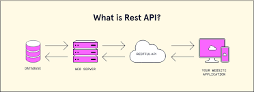

# RESTfull API:
  `R`presentacional `S`tate `T`ransfer
 A RESTful API, or REST API, is an interface that allows two 
 computer systems to securely exchange information over the
 internet.

 Most business applications have to communicate with other internal 
 and third-party applications to perform various tasks.

 
 
 MAIN CONCEPT:
 >RESOURCES
 >REPRESENTATION
 >HTTP METHOD: [POST, GET, PUT...]
 
 

 REST APIs provide a flexible, lightweight way to integrate applications
 and to connect components in microservices architectures.

