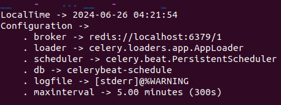
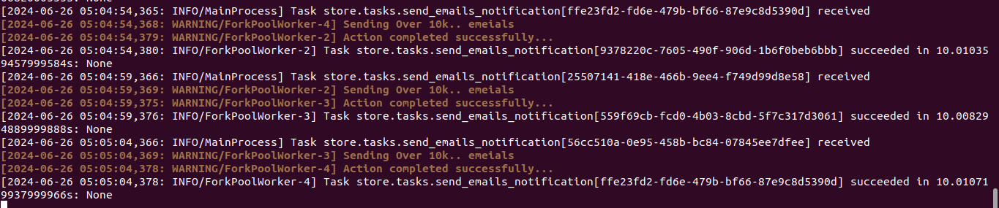

# Celery in DJANGO  (Using Redis)#

Celery is a distributed task queue system that can be used with Django
to perform asynchronous tasks such as sending emails, processing background
jobs, and more. 


In Django, applications can communicate with workers using various methods depending on the complexity of the task and desired level of decoupling.

  **Brokers List**
   - Redis
   - RabitMQ


*Doc based in redis*:
Queues or message Broker is one of them, You configure queues to hold tasks before they are processed by workers. Different queues can have different priorities or routing rules.

 **Asynchronous Task Queues**:
    A popular choice for handling a high volume of background tasks is likely 
    a distributed task queue system like Celery or a similar solution. This
    allows *Reddis* to efficiently process tasks like:
       - Uploading and processing user-submitted content (images, videos)
       - Sending notifications and emails
       - Updating user feeds and recommendations
       - Generating reports and analytics

This is like running a difficult and big function in another partition of our app, so it will not affect the performance of your app.


# How Use it #
Installing Redis using Docker:
  ``` docker run -d -p 6379:6379```

  *6379*: Means FROM 6379 TO 6379
  
  For example, the following command runs a Redis container and maps its port 6379 to port 10000 on the host machine:

  *command*: 
    ``docker run -p 10000:6379 redis``
   
   # 1. Intalling redis as Menssage Broker #
   ``` docker run -d -p 6379:6379 redis```
  
   ``` docker ps```
 
   *CONTAINER ID*   
    ea83de9a9b61
   
   *IMAGE*
    redis

   *COMMAND*       
    "docker-entrypoint.s…"
   
   *CREATED*          
    24 seconds ago
   
   *STATUS*         
    Up 21 seconds

   *PORTS*     
    0.0.0.0:6379->6379/tcp, :::6379->6379/tcp

   *NAMES*
    eager_bhabha

   # 2. Intalling redis and celery #
   ```pip install redis```
   ```pip install celery```

   # 3. Running Celery #

      Celery acts as a distributed task queue for Python applications.
      It's essentially a system for handling background tasks asynchronously,
      improving the responsiveness and scalability of your application.

      The first thing you need is a Celery instance. We call this the Celery 
      application or just app for short. As this instance is used as the entry-point
      for everything you want to do in Celery, like creating tasks and managing workers,
      it must be possible for other modules to import it.
      
  

  **ADD THE FOLLOW CONFIGURATION ON OUT celey.py FILE**
  first approach to doing it
  ```py
    from celery import Celery
    import os

    os.environ.setdefault('DJANGO_SETTING_MODULE', 'storefront.settings')
    # Set enviroment Variable to default #
    app= Celery(main='storefront', broker='redis://localhost:6379/1') # Module Name 
    app.autodiscover_tasks()
  ```
  We need to add it in the ``__init__.py`` in your setting file, otherwise python  wont invoke 
  this code:
  ```py 
     from .celery import app
  ```

  # Running Celery Working Proccesss #
  ``celery -A storefront worker --loglevel=info``
 
  ```
  -------------- celery@dari-Inspiron-5555 v5.4.0 (opalescent)
  --- ***** ----- 
  -- ******* ---- Linux-6.5.0-41-generic-x86_64-with-glibc2.35 2024-06-24 22:46:12
  - *** --- * --- 
  - ** ---------- [config]
  - ** ---------- .> app:         storefront:0x756f23bb5480
  - ** ---------- .> transport:   redis://localhost:6379/1
  - ** ---------- .> results:     disabled://
  - *** --- * --- .> concurrency: 4 (prefork)
  -- ******* ---- .> task events: OFF (enable -E to monitor tasks in this worker)
  --- ***** ----- 
  -------------- [queues]
                  .> celery           exchange=celery(direct) key=celery
                  

  ```
  So we're gonna une the ```redis``` that we already installed to send action fron any of our 
  application to de celery, so celery we'll invoked that worker to excute this taks.

  # Creating Executing Task #
    Something about celery is not limited to Django, While it's commonly used with 
    django for background task processing, celery can be integrated with other python
    applications as well. it's a versatile library that allow you to distribute tasks accross 
    worker those taks are assinged by redis, it follow almost the same steps as it's implemeted 
    in django.

  **ADD THE FOLLOW CONFIGURATION ON OUT celey.py FILE**
  Second approach to doing it
  ```py
     # DOCUMENTATION WAY: https://docs.celeryq.dev/en/stable/getting-started/ first-steps-with-celery. html#redis
     print("Active Celery Module")
     os.environ.setdefault('DJANGO_SETTINGS_MODULE', 'storefront.settings')
     Set enviroment Variable to default #
     app= Celery(main='storefront', broker='redis://localhost:6379/1') # Module Name
     app.autodiscover_tasks()
  ```
  
  **CALLING THE TASKS**

  ```myApp.task.py```
  ```py
      from time import sleep
      from celery import shared_task

      @shared_task
      def send_emails_notification(messages):
          print("Sending Over 10k.. emeials")
          print(messages)
          sleep(10) # means 10 senconds....
          print("Action completed successfully...")   
  ```
  
  ```myApp.views.py```
  ```py
    from django.shortcuts import render
    from django.core.mail import send_mail
    from .tasks import send_emails_notification 

    def action_hello(req:Request):
        print("Sending Email....")
        send_emails_notification.delay("TEST")
        return render(req, 'hello.html', {'name': 'Mosh'})
  ```
  # Periodic Tasks¶ Celery #
  ***You need to understand those points***
  - so basically, when you call the function
    with the decorator above, the shared_task
    add them to  the celery to pass them to the
    queue.

  - Celery is constantly beating like our heart to  
    add those function process to the queue.

  ```storefront.settings.py```
  ```py
      CELERY_BEAT_SCHEDULE = {
        'send_emails_notification':{
            'task':'store.tasks.send_emails_notification',
            'schedule': 5, # it means each 5s 
        }
    }
  ```

  ```CELERY_BEAT_SCHEDULE```
  Celery beat is scheduler; it kicks off tasks at regular
  intervals, that are then executed by avaible workes nodes
  in the cluser.


  We can configurate the execution of those intervals by 
  using the configuration schedule of celery, something like
  this:
  ```py 
   # https://docs.celeryq.dev/en/stable/reference/celery.schedules.html
   from celery.schedules import crontab
   CELERY_BEAT_SCHEDULE = {
      'send_emails_notification':{
          'task':'store.tasks.send_emails_notification',
          'schedule': crontab(day_of_week=1, hour=7, minute=30), #(day_of_week=moday, hour=7, minute=30)
          'kwargs': {}, # optional,
          'args:':[],# optional 
      }
   }
  ```
 ## Start rhe beating in celery ##
 Now we need to open the terminal, and as the command 
 of wokers, we're going to run the command to start the 
 beating proccesing of celery:

 ```celery -A storefront beat```
 
  

  Now it will invoke the function every 5s in the 
  celery queu.
  

AUTOMATING TESTING: [text](../Automation_Testing/documentation.md)