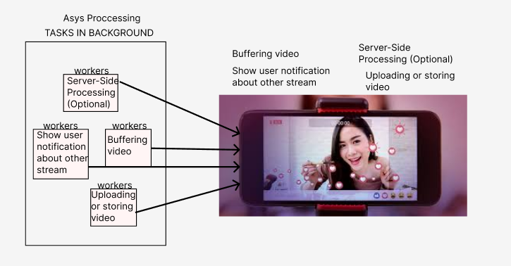
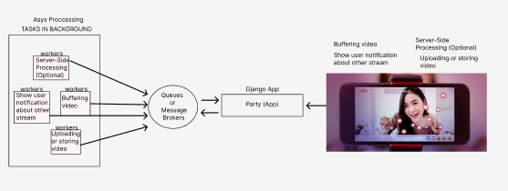
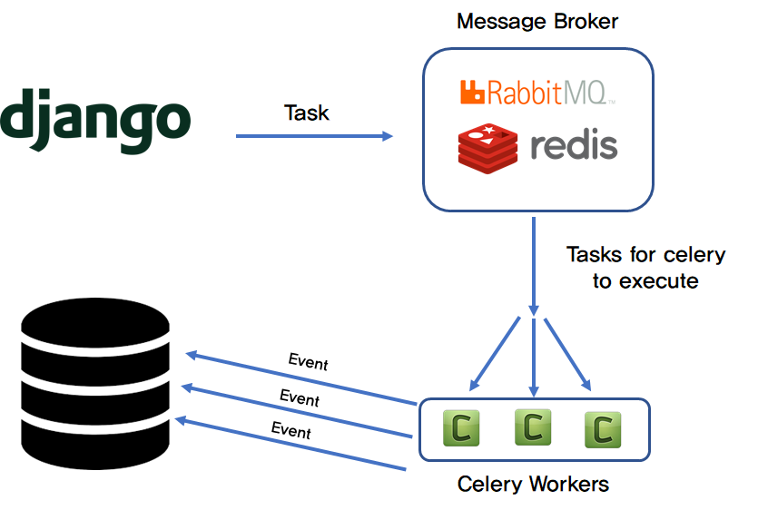
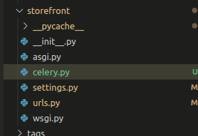

# Celery in DJANGO  (Using Redis)#

Celery is a distributed task queue system that can be used with Django
to perform asynchronous tasks such as sending emails, processing background
jobs, and more. 



In Django, applications can communicate with workers using various methods depending on the complexity of the task and desired level of decoupling.

  **Brokers List**
   - Redis
   - RabitMQ



*Doc based in redis*:
Queues or message Broker is one of them, You configure queues to hold tasks before they are processed by workers. Different queues can have different priorities or routing rules.

 **Asynchronous Task Queues**:
    A popular choice for handling a high volume of background tasks is likely 
    a distributed task queue system like Celery or a similar solution. This
    allows *Reddis* to efficiently process tasks like:
       - Uploading and processing user-submitted content (images, videos)
       - Sending notifications and emails
       - Updating user feeds and recommendations
       - Generating reports and analytics

This is like running a difficult and big function in another partition of our app, so it will not affect the performance of your app.



# How Use it #
Installing Redis using Docker:
  ``` docker run -d -p 6379:6379```
  *6379*: Means FROM 6379 TO 6379
  
  For example, the following command runs a Redis container and maps its port 6379 to port 10000 on the host machine:

  *command*: 
    ``docker run -p 10000:6379 redis``
   
   # 1. Intalling redis as Menssage Broker #
   ``` docker run -d -p 6379:6379 redis```
   ``` docker ps```
 
   *CONTAINER ID*   
    ea83de9a9b61
   
   *IMAGE*
    redis

   *COMMAND*       
    "docker-entrypoint.s…"
   
   *CREATED*          
    24 seconds ago
   
   *STATUS*         
    Up 21 seconds

   *PORTS*     
    0.0.0.0:6379->6379/tcp, :::6379->6379/tcp

   *NAMES*
    eager_bhabha

   # 2. Intalling redis and celery #
   ```pip install redis```
   ```pip install celery```

   # 3. Running Celery #
      Celery acts as a distributed task queue for Python applications.
      It's essentially a system for handling background tasks asynchronously,
      improving the responsiveness and scalability of your application.

      The first thing you need is a Celery instance. We call this the Celery 
      application or just app for short. As this instance is used as the entry-point
      for everything you want to do in Celery, like creating tasks and managing workers,
      it must be possible for other modules to import it.
      
  