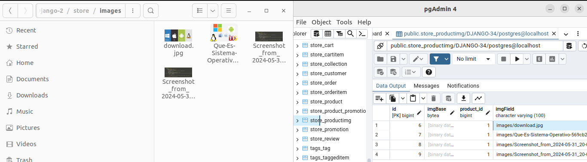
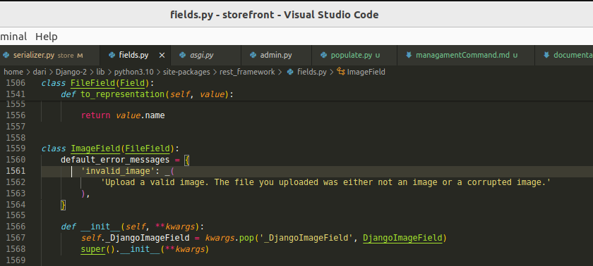
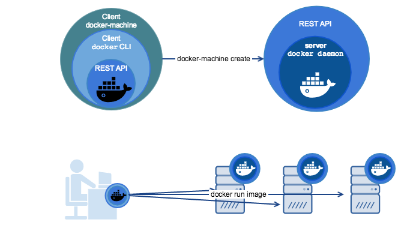
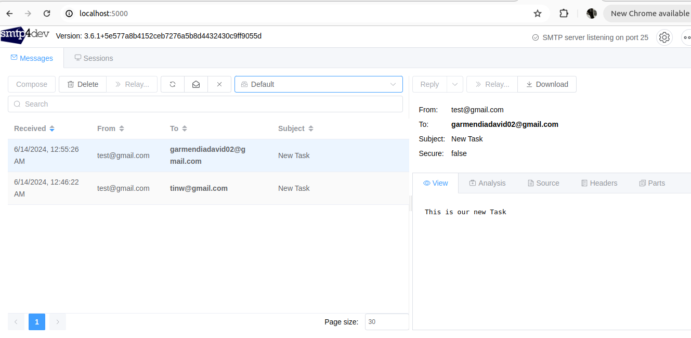

# Uploading File in Django #
 In Python, if you are using the Django web framework, you
 can use Django's built-in **FileField** and **ImageField**
 model fields to handle file uploads.
 
 The idea is to understand how all of this works under the
 hood and how we can customize it.

 In Django, FileField, FilePathField, and ImageField are all fields used to
 store files in a model, but they have some differences in their behavior and usage.

 The `FileField` is used to store any type of file, like text, pdf, images, or videos. It does not store the file directly in the database; instead, it uses `upload_to`. Here, you decide where to store all those images in your directory. That path to that directory and the name of the image will be stored in the database it also use the validators to validate the uploaded file based on its file extension, size, or content.
   
   

 We're going to create an example of how all of this happens based on ImageFile.
 It follows the same steps as FileField; the reason for that is because the `imageFile`
 is an instance of the same `FileField`.
  
  
  ``code source default by django``
 
 # 1. Add media file/set media locations to settings.py #
*** What are static and media files? ***

    First off, you'll typically find these three types of files in a Django project:

   `Source code`: These are your core Python modules and HTML files that make up every Django project, where you 
                  define your models, views, and templates.
   
   `Static files`: These are your CSS stylesheets, JavaScript files, fonts, and images. Since there's no processing 
                   involved,  these files are very energy efficient since they can just be served up as is. They are
                  also much easier to cache.
   
   `Media file:` These are files that a user uploads.


   ***Storage Location ***:

   `Static Files`: Static files are typically stored in a dedicated directory within your project structure. They are often placed in a subfolder named static within an app or at the project level (e.g., project_name/static).
    
   `Media Files`: Media files are usually stored outside your project's root directory for security reasons. They are commonly placed in a directory named media at the project level (e.g., outside project_name).


   This article focuses on static and media files. Even though the names are different, both represent regular files. The significant difference is that static files are kept in version control and shipped with your source code files.


   ``Setting the media location``
   ``setting.py`` and ``models.py``

  ``models.py``
   ```.py
   def upload_to(instance, filename):
    print(filename)
    return 'images/{filename}'.format(filename=filename)

  class productImg(models.Model):
      product = models.ForeignKey(Product, on_delete=models.CASCADE, related_name='imgs') # if we delete the product it will delete the img 
      imgBase = models.BinaryField(blank=True)
      imgField = models.ImageField(upload_to=upload_to, blank=True, null=True)

   ```
   Let's take a look at the `upload_to` function, which is passed as an attribute in the `imgField` in the `upload_to` method.
   The `upload_to` goes to rerun a string, which retrun the path where the image will be stored.

   This relative path must be created according to the file configuration in your `setting.py`.
   ```py
        """
        Django settings for storefront project.

        Generated by 'django-admin startproject' using Django 3.2.3.

        For more information on this file, see
        https://docs.djangoproject.com/en/3.2/topics/settings/

        For the full list of settings and their values, see
        https://docs.djangoproject.com/en/3.2/ref/settings/
        """ 

        from pathlib import Path
        from datetime import timedelta
        import os

        # Build paths inside the project like this: BASE_DIR / 'subdir'.
        BASE_DIR = Path(__file__).resolve().parent.parent # /home/dari/Django-2
        print("BASE DIR")# /home/dari/Django-2 the parent of storefront flle
        print(BASE_DIR)

        # Actual directory user files go to
        MEDIA_ROOT = os.path.join(os.path.dirname(BASE_DIR), 'store')  # /home/dari/Django-2/store # create the storeFile


        print("MEDIA_ROOT")
        print(MEDIA_ROOT)

        # URL used to access the media
        MEDIA_URL = '/media/'
         # media files are files that your end-users (internally and externally)
         # upload or are dynamically created by your application (static() // method) (often as a side 
         # effect of some user action).
        
  ``` 
 **Essential configuration settings for handling media files:**

`MEDIA_URL`:Similar to the STATIC_URL, this is the URL where 
            users can access media files.

`MEDIA_ROOT`:The absolute path to the directory where your Django
             application will serve your media files from.


  ```urls.py```
  ```py
      """storefront URL Configuration

      The `urlpatterns` list routes URLs to views. For more information please see:
          https://docs.djangoproject.com/en/3.2/topics/http/urls/
      Examples:
      Function views
          1. Add an import:  from my_app import views
          2. Add a URL to urlpatterns:  path('', views.home, name='home')
      Class-based views
          1. Add an import:  from other_app.views import Home
          2. Add a URL to urlpatterns:  path('', Home.as_view(), name='home')
      Including another URLconf
          1. Import the include() function: from django.urls import include, path
          2. Add a URL to urlpatterns:  path('blog/', include('blog.urls'))
      """
      from django.contrib import admin
      from django.urls import path, include
      import debug_toolbar
      from django.conf.urls.static import static
      from django.conf import settings

      admin.site.site_header = 'Storefront Admin'
      admin.site.index_title = 'Admin Panel'


      img_roots = static(settings.MEDIA_URL, document_root=settings.MEDIA_ROOT)
      print(img_roots)

      urlpatterns = [
          path('admin/', admin.site.urls),
          path('store/', include('store.urls')),
          path('__debug__/', include(debug_toolbar.urls)),
          path('auth/', include('djoser.urls')),
          path('auth/', include('djoser.urls.jwt')),
      ] +  img_roots
  ```
  
  Static and media files are different and must be treated 
  differently for security purposes.

  In the way production and distribution are completely different
  for security, the method of use it must to change.


# working with Email Django #
As a software developer working with Django, you may need to set up email
functionality for your web application. 

Gmail discontinued login-password auth for apps since May 2022. Now one needs to turn
on 2FA on gmail account and after that generate an app password, which can be used instead 
of real password. https://support.google.com/accounts/answer/185833

**Sumary Reasons**: 
`Security`: Login-password auth is a less secure method compared to modern authentication techniques. Passwords can be vulnerable to hacking or phishing attacks. By removing this option, Google aims to make it more difficult for unauthorized access to your Gmail account.

`Modernization`: Google is encouraging developers to use more secure authentication methods like OAuth 2.0. This protocol provides a more robust and reliable way for apps to access your Gmail data without directly storing your password. OAuth 2.0 also allows for granular control over what data an app can access.

# SMTP SERVER #
SMTP, which stands for Simple Mail Transfer Protocol, is the foundation of email delivery on
the internet. It defines the communication protocol between email clients.


Imagine email as a physical letter. SMTP servers act like the post office that takes your outgoing emails, verifies the address, and routes them to the recipient's mail server.

In simpler terms, SMTP servers are specialized computers designed to send, receive, and relay emails between different mail servers on the internet.

You cannot send email directly from your application or script without using an SMTP 
server.

**Docker**
Docker is an open-source platform that enables developers to package software into standardized units called containers. These containers include everything needed to run an application: code, runtime, system tools, system libraries, and settings

Docker is an open-source platform that enables developers to package software into standardized units called containers. These containers include everything needed to run an application:
code, runtime, system tools, system libraries, and settings.




**CREATION OF A FAKE SMTP SERVER**
 Github Configuration:
    https://github.com/rnwood/smtp4dev/wiki/Installation
 
 *COMMAND:*
     `sudo docker run --rm -it -p 5000:80 -p 2525:25 rnwood/smtp4dev`
     

  Documentation: https://docs.djangoproject.com/en/5.0/topics/email/
  